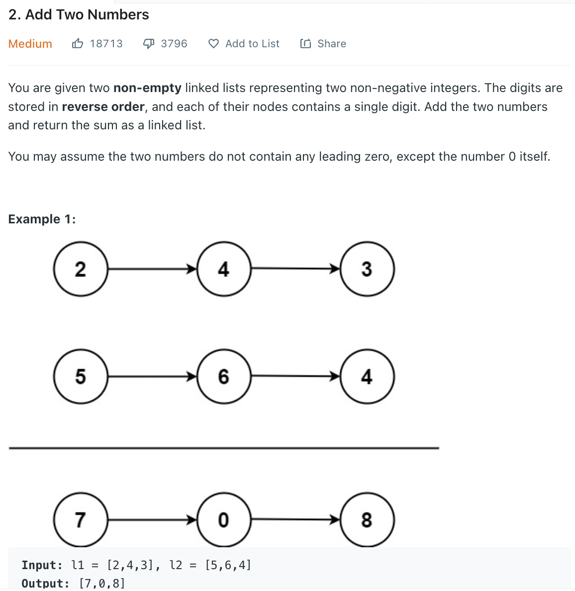

# 2. Add Two Numbers
Linked List로 구현된 두 자연수를 더하는 문제.



## Solution 1. recursive solution
메모리를 최소화하기 위해 l1의 공간을 재활용한다.

```python
# Definition for singly-linked list.
# class ListNode:
#     def __init__(self, val=0, next=None):
#         self.val = val
#         self.next = next
class Solution:
    def calculateCarryVal(self, val):
        if val >= 10:
            return val - 10, 1
        
        return val, 0

    def _addTwoNumbers(self, l1, l2, carry):
        if not l1 and not l2:
            if carry == 0:
                return None
            else:
                return ListNode(1, None)

        val = carry
        next_carry = 0
        l1_next = None
        l2_next = None

        if l1 and l2:
            val = val + l1.val + l2.val
            l1_next = l1.next
            l2_next = l2.next
        elif l1:
            val = val + l1.val 
            l1_next = l1.next
        elif l2:
            val = val + l2.val
            l2_next = l2.next
            l1 = l2 
        
        new_val, next_carry = self.calculateCarryVal(val)
        l1.val = new_val
        l1.next = self._addTwoNumbers(l1_next, l2_next, next_carry)
        return l1 

    def addTwoNumbers(self, l1: Optional[ListNode], l2: Optional[ListNode]) -> Optional[ListNode]:
        return self._addTwoNumbers(l1, l2, 0)
```


실행속도와 메모리가 생각보다 안 좋다. 더 좋은 방법이 있을까?

## 2. Iterative Solution, In-Place (O(1) Memory)

내가 볼 땐 memory overhead 도 없어서 최고의 solution인데 메모리를 더 먹는다고 뜬다... 아마 l1 = l2 할 떼 address가
아니라 shallow copy를 해버리는 것 같은데 자세한 건 확인해봐야 할 듯...

```python
# Definition for singly-linked list.
# class ListNode:
#     def __init__(self, val=0, next=None):
#         self.val = val
#         self.next = next
class Solution:
    def calculate_val(self, current_l1, current_l2, carry):
        val = carry
        if current_l1 and current_l2:
            val = val + current_l1.val + current_l2.val
        elif current_l1:
            val = val + current_l1.val
        elif current_l2:
            val = val + current_l2.val
        
        if val >= 10:
            return val - 10, 1
        
        return val, 0
        
    def addTwoNumbers(self, l1: Optional[ListNode], l2: Optional[ListNode]) -> Optional[ListNode]:
        current_l1 = None
        current_l2 = None
        carry = 0

        if l1 and l2:
            current_l1 = l1
            current_l2 = l2
        elif l1:
            current_l1 = l1
        elif l2:
            current_l1 = l2
        
        while current_l1 or current_l2:
            val, carry = self.calculate_val(current_l1, current_l2, carry)

            current_l1.val = val

            if current_l1 and current_l2:
                current_l1 = current_l1.next
                current_l2 = current_l2.next
            elif current_l1:
                current_l1 = current_l1.next
            elif current_l2:
                current_l1.next = current_l2.next
                current_l1 = current_l2.next
                current_l2 = None
        
        if carry == 1:
            current_l1.next = ListNode(1)

        return l1 
```

* 여러가지 타협이 가능한 문제라 파악 끝으로 판단.
   * 여러 번 돌게 solution하면 코드가 간단해짐. 대신 time overhead + memory overhead 심해진다
   * 한 번만 돌게 하면 time overhead는 빨라진다. 이 때
      * **in space solution을 추구하면 O(1) 메모리지만 코드가 복잡해지고**
      * in space를 포기하면 훨씬 간단한 로직으로 구현 가능하다.