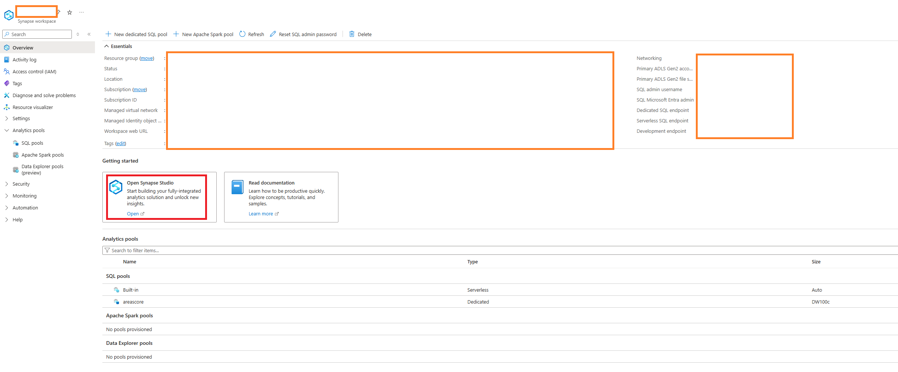

I was doing a project helping an environmental organization find ways to better store and utilize their geospatial data(mostly .shp files and point clouds).

As a solution we recommended moving their data from Dropbox to Azure (Blob Storage) for more flexible storage management and options to analyze data.

To give a proof-of-concept about the benefits of using cloud storage, I made a geospatial analytics prototype using Azure Synapse Analytics.

# 1. Creating Synapse Analytics Workspace

To use Synapse Analytics, we have to create a workspace to use our data. Create new account/file system name

After we create workspace, we'll have it on the workspace menu on Azure Synapse Analytics

Create an `apache spark pool`

Go back to the workspace and click `Open Synapse Studio`

Go to develop -> + -> new notebook

Rename notebook and assign the spark pool we created earlier

- Now we can use spark resources to do spark tasks in Azure Synapse Analytics.
- Unlike other spark environments, you don't have to start a spark session at the beginning of the notebook, because the notebook automatically starts session in variable 'spark' when the notebook starts.
