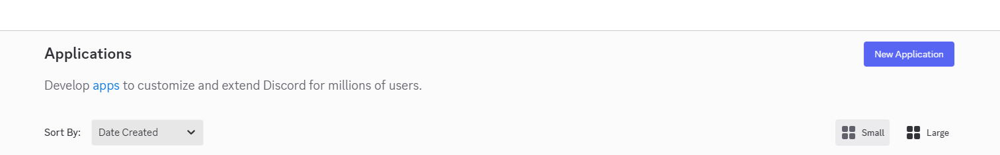
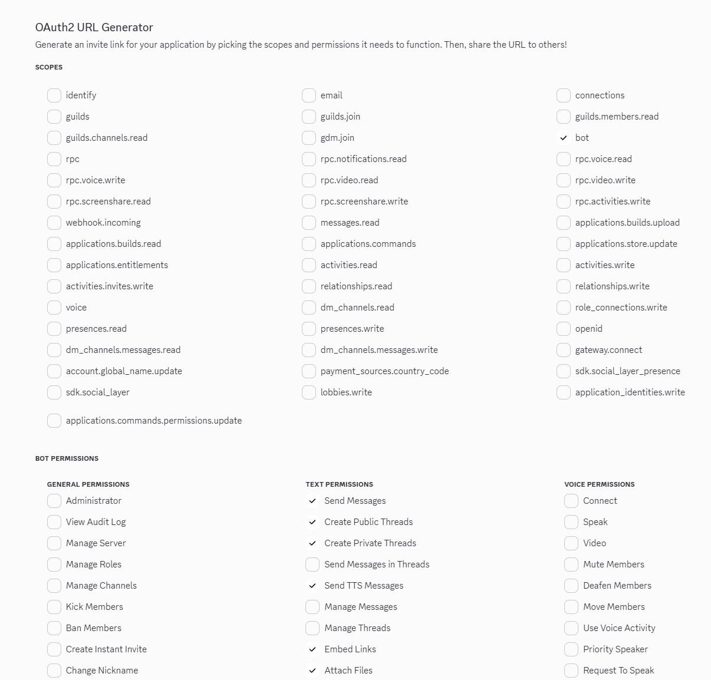
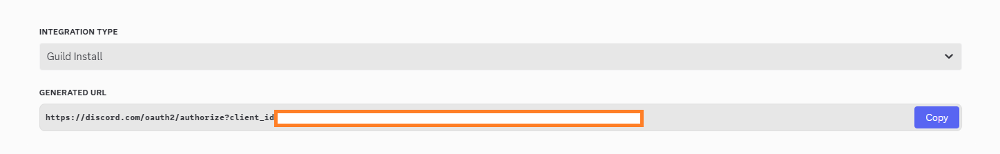
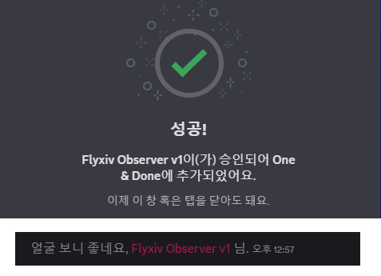
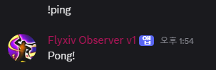
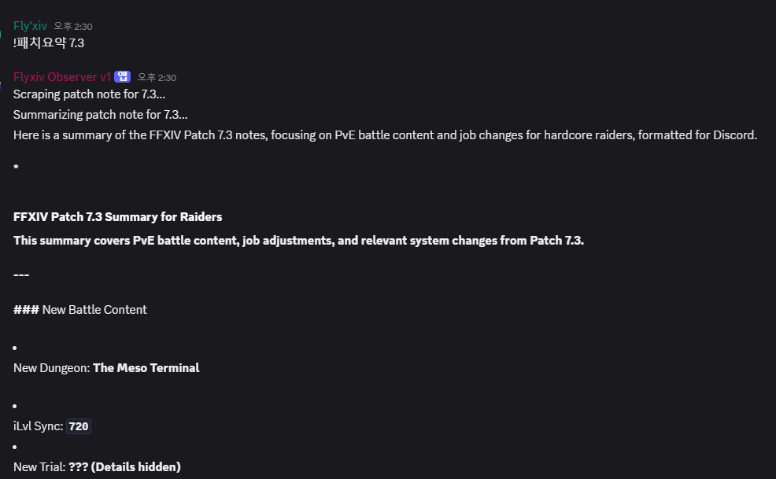

# Create a Bot

https://discord.com/developers/applications

Create a bot in the home menu



create a discord bot in `OAuth2` tab with `bot` scope and priviliges you want to give



An invite URL will pop up. Now we select the server we want to put our bot in, and it will be invited





Now we create Bot Token

# Create Bot Server

Now we're going to make a python server to make the Bot respond to events and commands.

```sh
# python 3.13.5
$ pip install discord-py dotenv
```

```py
import discord
import os
from dotenv import load_dotenv

load_dotenv()
TOKEN = os.getenv('DISCORD_TOKEN')

# Enable message content intent
intents = discord.Intents.default()
intents.message_content = True

bot = commands.Bot(command_prefix='!', intents=intents)

@bot.event
async def on_ready():
    print(f'{bot.user} has connected to Discord!')

@bot.command()
async def ping(ctx):
    await ctx.send('Pong!')


bot.run(TOKEN)
```

Now when I !ping, the bot responds with !pong



# Creating LLM commands

Now I want the bot to request Gemini for APIs

```python
# request_gemini.py
import yaml
import google.generativeai as genai
import os
from enum import Enum

# Load API key from environment variable or config file
def get_gemini_api_key():
    return os.getenv('GEMINI_API_KEY')

gemini_api_key = get_gemini_api_key()

class GeminiModels(Enum):
    GEMINI_2_5_FLASH_LITE = "gemini-2.5-flash-lite"
    GEMINI_2_5_FLASH = "gemini-2.5-flash"
    GEMINI_2_5_PRO = "gemini-2.5-pro"

def request_gemini(model: GeminiModels, prompt, image_url=None):
    genai.configure(api_key=gemini_api_key)

    model = genai.GenerativeModel(model.value)

    if image_url:
        response = model.generate_content(prompt, image_url)
    else:
        response = model.generate_content(prompt)

    return response


# commands.py
from discord.ext import commands
import discord
from pyobserver.request_gemini import request_gemini, GeminiModels
import requests
from bs4 import BeautifulSoup
import asyncio

def scrape_webpage(url):
    response = requests.get(url)
    soup = BeautifulSoup(response.content, 'html.parser')

    text = soup.get_text(strip=True)
    return text

patch_note_urls = {
    '7.3': 'https://na.finalfantasyxiv.com/lodestone/topics/detail/c04405c6cbe8519a0b6c8aa5e4d88a5d447419c9'
}

CHUNK_SIZE = 1500


class FFXIVInfoScraper(commands.Cog):
    def __init__(self, bot):
        self.bot = bot

    @commands.command(name='summarize_patchnote', aliases=['패치요약'])
    async def summarize_patchnote(self, ctx, patch_version: str):
        await ctx.send(f"Scraping patch note for {patch_version}...")
        webpage_content = scrape_webpage(patch_note_urls[patch_version])

        prompt = f"""
        You are a helpful assistant that summarizes patchnotes.
        You will be given a patch note url.
        You will need to summarize the patchnote.

        The scraped patch note page is: {webpage_content}

        I am a hardcore raider so I'm only interested in the battle content and balance changes in PVE.
        Create a discord markdown document with the job changes with the exact number changes and content updates summarized.
        """


        await ctx.send(f"Summarizing patch note for {patch_version}...")
        response = request_gemini(GeminiModels.GEMINI_2_5_FLASH, prompt)

        text = response.text
        print(text)

        if len(text) > CHUNK_SIZE:
            for i in range(0, len(text), CHUNK_SIZE):
                chunk = text[i:i+CHUNK_SIZE]
                await ctx.send(chunk)
                await asyncio.sleep(1)
        else:
            await ctx.send(text)

    @commands.command(name='healthcheck')
    async def healthcheck(self, ctx):
        await ctx.send('Live and ready!')

async def setup(bot):
    await bot.add_cog(FFXIVInfoScraper(bot))


# main.py
import discord
import os
from dotenv import load_dotenv
from discord.ext import commands

load_dotenv()
TOKEN = os.getenv('DISCORD_TOKEN')

# Enable message content intent
intents = discord.Intents.default()
intents.message_content = True

bot = commands.Bot(command_prefix='!', intents=intents)

@bot.event
async def on_ready():
    print(f'{bot.user} has connected to Discord!')
    await bot.load_extension('pyobserver.commands')

bot.run(TOKEN)
```

Now we can give summarize_patchnote command, and the bot will ask Gemini for response.



Not the cleanest format, but I can tune the output further using my prompt.

Since now we have a discord bot connected with LLM, so we can use agents in our discord server to automate tasks that I want.
