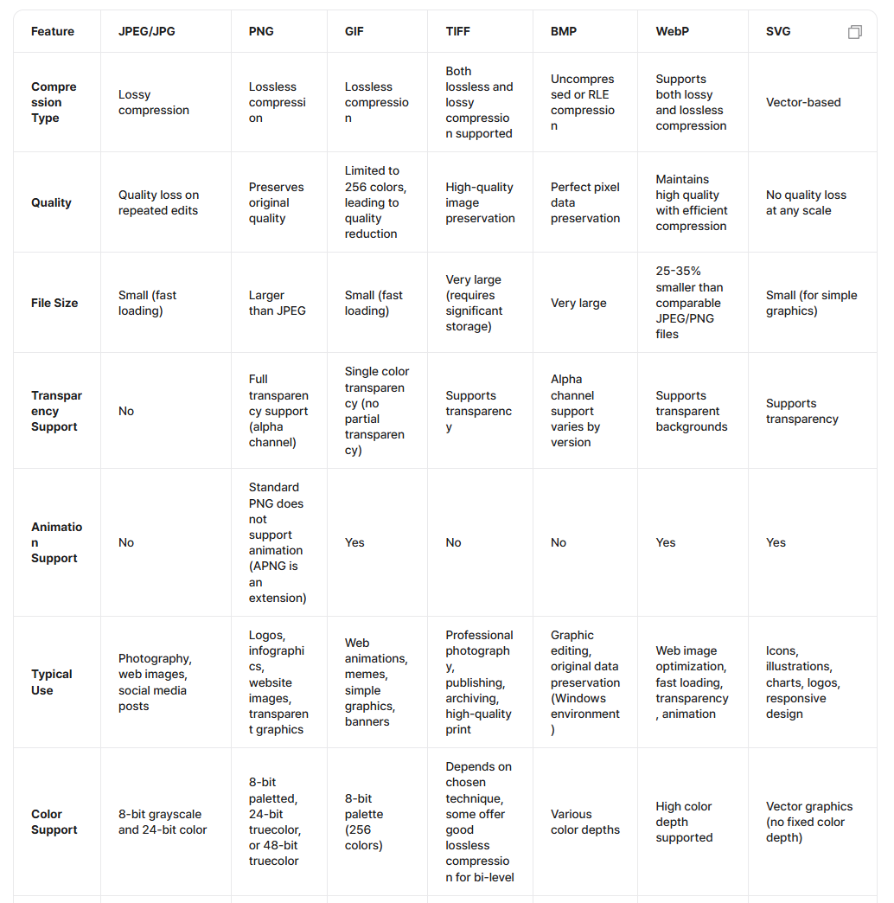
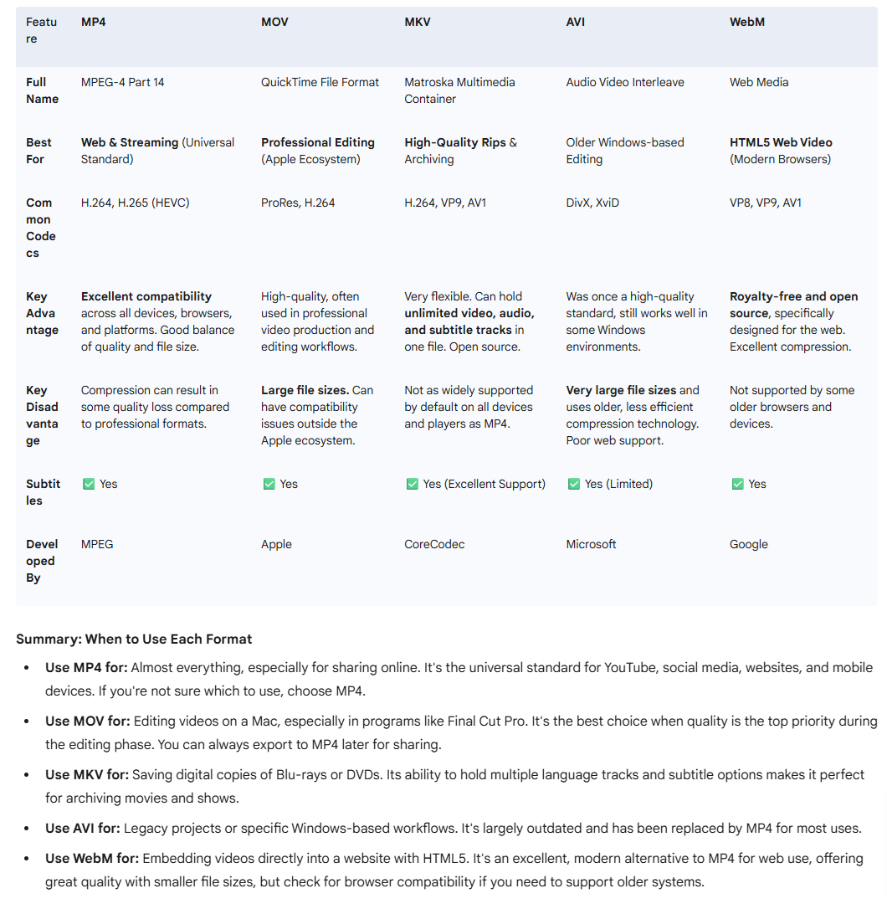
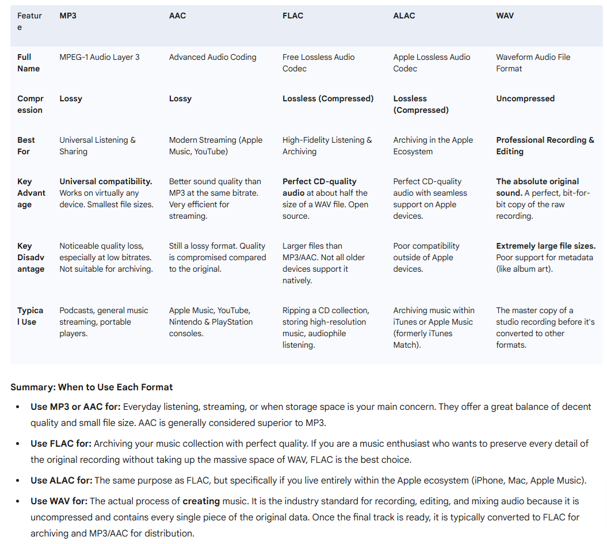

# Editing Media Data

## Types of Image Formats

## Types of Video Formats

### What is a codec?

`CO`mpression - `DEC`omposition

We can't save every pixel of all frames - **It's gonna be too large(1920\*1080 image, 30FPS, 10min video: 108GB)**

1. Intra-frame compression
   Compress in a single image

- Compress repeated sequence (ex) blue sky - `blue pixel from a to b`)

2. Inter-frame Compression
   Save only the difference between consecutive frames

- Person talking: only save the mouth movement

## Types of Audio Formats

## Other Terms

Bitrate: **Amount of bits to represent 1 second of video/audio**
Video Encoder: NVENC, H.264/HEVC, software(x264)
