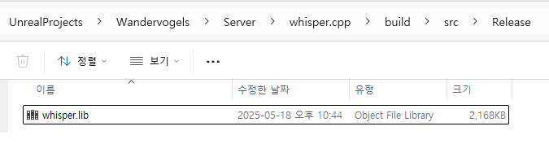
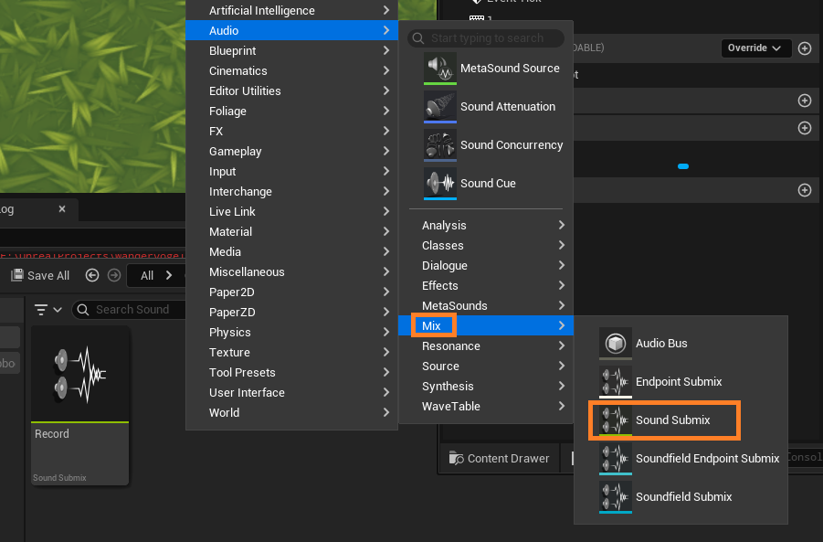

I'm going to make a game that interacts with NPCs with voice.

To do that I need to install a voice recognition AI model which translates user's voice into natural language.

OpenAI has a model called `whisper` which does exactly this, and it has a community C++ extension(https://github.com/ggml-org/whisper.cpp)

I'm setup this whisper.cpp in my game file so that we can run it locally.

# 1. Clone Repository and Download Model Weights

```sh
$ git clone https://github.com/ggml-org/whisper.cpp.git
$ cd whisper.cpp

$ sh ./models/download-ggml-model.cmd base
```

# 2. Build whisper.cpp to Create Static Library Files

## Build whisper.cpp library

```sh
$ mkdir build
$ cd build

$ cmake -DGGML_CUDA=ON -DCMAKE_BUILD_TYPE=Release -DBUILD_SHARED_LIBS=OFF ..
$ cmake --build . --config Release
```

.lib file is created in `build/src`



# 3. Create WhisperIntegration Library to use in Unreal Engine 5.5

1. Move model(`ggml-large-v3.bin`) to `Content/Models`
2. Create `Plugins` directory in the base project directory, and create the following structure inside `Plugins`:

```
─WhisperIntegration
    ├─WhisperIntegration.uplugin
    │
    ├─Source
    │  └─WhisperIntegration
    │      ├─  WhisperIntegration.Build.cs
    │      │
    │      ├─Private
    │      │     ├─ WhisperBPLibrary.cpp
    │      │     ├─ WhisperIntegration.cpp
    │      │
    │      └─Public
    │            ├─ WhisperBPLibrary.h
    │            ├─ WhisperIntegration.h
    │
    └─ThirdParty
        └─whisper.cpp
            ├─include
            │    ├─ whisper.h
            │    ├─ ggml.h
			|    ├─ ggml-cpu.h
			|    ├─ ggml-gpu.h
			|    ├─ ggml-backend.h
			|    ├─ ggml-alloc.h
			|
            └─lib
                └─Win64
                    ├─ whisper.lib
                    ├─ ggml.lib
                    ├─ ggml-cpu.lib
                    ├─ ggml-gpu.lib
                    ├─ ggml-base.lib

```

1. `whisper.h` will be in `whisper.cpp/include`
2. Other include files are in `whisper.cpp/ggml/include`
3.
4. Leave `WhisperComponent.cpp/h` empty for now
5. `WhisperIntegration.Build.cs` is as follows:

```cs
using System.IO;
using UnrealBuildTool;

public class WhisperIntegration : ModuleRules
{
	public WhisperIntegration(ReadOnlyTargetRules Target) : base(Target)
	{
		PCHUsage = PCHUsageMode.UseExplicitOrSharedPCHs;
        PublicIncludePaths.Add(Path.GetFullPath(Path.Combine(ModuleDirectory, "Public")));
        PrivateIncludePaths.Add(Path.GetFullPath(Path.Combine(ModuleDirectory, "Private")));


        PublicDependencyModuleNames.AddRange(new[] {
            "Core", "CoreUObject", "Engine", "InputCore", "AudioCaptureCore", "SignalProcessing"
        });

        string ThirdPartyPath = Path.Combine(ModuleDirectory, "..", "ThirdParty", "whisper.cpp");
        PublicIncludePaths.Add(Path.Combine(ThirdPartyPath, "include"));

        string LibPath = Path.Combine(ThirdPartyPath, "lib");
        string[] NeededLibs = { "whisper.lib", "ggml.lib", "ggml-base.lib", "ggml-gpu.lib", "ggml-cpu.lib" };

        foreach (string Lib in NeededLibs)
        {
            PublicAdditionalLibraries.Add(Path.Combine(LibPath, Lib));
        }
    }
}
```

6. `WhisperIntegration.uplugin` is as follows:

```json
{
  "FileVersion": 3,
  "Version": 1,
  "VersionName": "1.0",
  "FriendlyName": "Whisper Integration",
  "Description": "Integration of whisper.cpp for speech recognition in UE5",
  "Category": "Audio",
  "CreatedBy": "Your Name",
  "CreatedByURL": "",
  "DocsURL": "",
  "MarketplaceURL": "",
  "SupportURL": "",
  "CanContainContent": true,
  "IsBetaVersion": false,
  "IsExperimentalVersion": false,
  "Installed": false,
  "Modules": [
    {
      "Name": "WhisperIntegration",
      "Type": "Runtime",
      "LoadingPhase": "Default"
    }
  ]
}
```

Now right click on .uproject file and rebuild

# 4. Add Plugins Source

- `WhisperBPLibrary.h`

```cpp
#pragma once

#include "CoreMinimal.h"
#include "Kismet/BlueprintFunctionLibrary.h"
#include "AudioMixerDevice.h"
#include "Engine/World.h"
#include "WhisperBPLibrary.generated.h"

static TUniquePtr<Audio::FAudioRecordingData> RecordData;

UCLASS()
class WHISPERINTEGRATION_API UWhisperBPLibrary : public UBlueprintFunctionLibrary // 모듈 API 매크로 확인!
{
	GENERATED_BODY()

public:
	UFUNCTION(BlueprintCallable, Category = "Whisper Integration", meta = (WorldContext = "WorldContextObject", DisplayName = "Translate Mic To Text(Whisper)"))
	static FString TranslateMicToText(const UObject* WorldContextObject, USoundSubmix* SubmixToRecord = nullptr);

	UFUNCTION(BlueprintCallable, Category = "Whisper Integration", meta = (DisplayName = "Transcribe Audio Buffer (Whisper)"))
	static FString TranscribeAudioBuffer(const TArray<float> &PCMData);

	static void Resample(const float* InAudio, int32 NumFrames, int32 NumChannels, int32 StartSampleRate, Audio::FAlignedFloatBuffer& OutAudio);
};
```

- `WhisperIntegration.h`

```cpp
#pragma once

#include "whisper.h"
#include "CoreMinimal.h"
#include "Modules/ModuleInterface.h"

struct whisper_context;

class FWhisperIntegrationModule : public IModuleInterface
{
public:
    virtual void StartupModule() override;
    virtual void ShutdownModule() override;

    static inline FWhisperIntegrationModule& Get() {
        return FModuleManager::GetModuleChecked<FWhisperIntegrationModule>("WhisperIntegration");
    }

    bool InitializeModel(const FString& ModelPath);
    FString TranscribeFromBuffer(const float* PCMData, int32 SampleCount);

private:
    whisper_context* _context = nullptr;
};
```

- `WhisperBPLibrary.cpp`

```cpp
#pragma once

#include "whisper.h"
#include "CoreMinimal.h"
#include "Modules/ModuleInterface.h"

struct whisper_context;

class FWhisperIntegrationModule : public IModuleInterface
{
public:
    virtual void StartupModule() override;
    virtual void ShutdownModule() override;

    static inline FWhisperIntegrationModule& Get() {
        return FModuleManager::GetModuleChecked<FWhisperIntegrationModule>("WhisperIntegration");
    }

    bool InitializeModel(const FString& ModelPath);
    FString TranscribeFromBuffer(const float* PCMData, int32 SampleCount);

private:
    whisper_context* _context = nullptr;
};
```

- `WhisperIntegration.cpp`

```cpp
#include "WhisperIntegration.h"
#include "Misc/Paths.h"
#include "HAL/PlatformMisc.h"

#define LOCTEXT_NAMESPACE "FWhisperIntegrationModule"

void FWhisperIntegrationModule::StartupModule()
{
    UE_LOG(LogTemp, Display, TEXT("WhisperIntegration module starting up"));
    InitializeModel("Models/ggml-base.bin");
}

void FWhisperIntegrationModule::ShutdownModule()
{
    if (_context) {
        whisper_free(_context);
        _context = nullptr;
    }

    UE_LOG(LogTemp, Display, TEXT("WhisperIntegration module shutting down"));
}

bool FWhisperIntegrationModule::InitializeModel(const FString& ModelPath) {
    if (_context) return true;

    FString FullPath = FPaths::ProjectContentDir() / ModelPath;


	whisper_context_params PARAMS;
	PARAMS.use_gpu = true;
	PARAMS.gpu_device = 0;
    _context = whisper_init_from_file_with_params(TCHAR_TO_UTF8(*FullPath), PARAMS);

    if (!_context) {
        UE_LOG(LogTemp, Error, TEXT("Failed to load model in path: %s"), *FullPath);
	}
	else {
		UE_LOG(LogTemp, Display, TEXT("Loaded Model!!!!!!"));
	}

    return _context != nullptr;
}

FString FWhisperIntegrationModule::TranscribeFromBuffer(const float* PCMData, int32 SampleCount)
{
	if (!_context)
	{
		UE_LOG(LogTemp, Error, TEXT("Whisper model not initialized!"));
		return FString();
	}


	whisper_full_params Params = whisper_full_default_params(WHISPER_SAMPLING_GREEDY);
	Params.n_threads = FMath::Max(1, FPlatformMisc::NumberOfCoresIncludingHyperthreads());
	Params.offset_ms = 0;
	Params.translate = false;
	Params.print_realtime = false;
	Params.logprob_thold = -1.0f;
	Params.no_speech_thold = 0.0f;
	Params.language = "ko";

	int32 Success = whisper_full(_context, Params, PCMData, SampleCount);
	if (Success != 0)
	{
		UE_LOG(LogTemp, Error, TEXT("whisper_full failed: %d"), Success);
		return FString();
	}

    FString ResultText = TEXT("");
    const int NumSegments = whisper_full_n_segments(_context);

    for (int32 i = 0; i < NumSegments; ++i) {
        const char* SegmentTextAnsi = whisper_full_get_segment_text(_context, i);
        if (SegmentTextAnsi)
        {
            ResultText += FString(UTF8_TO_TCHAR(SegmentTextAnsi));
        }
    }

	return ResultText;
}

#undef LOCTEXT_NAMESPACE

IMPLEMENT_MODULE(FWhisperIntegrationModule, WhisperIntegration)
```

# 5. Add Recording and Whisper API to Character

1. We create a submix and name it `Record`



2. We create a `AudioCaptureComponent` in Character and Connect the following blueprints:


Now when we start the game and press 1 -> speak -> release 1, the `whisper` model transcribes what we said into natural language.
