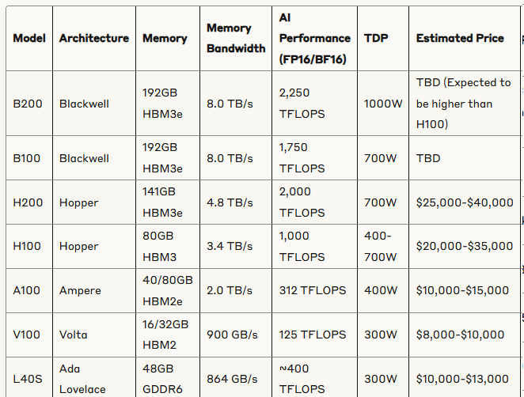

To be a good machine learning engineer you have to know what types of GPUs there are and their relative performances.

# 1. Data Center GPUs (AI/HPC)

The best GPU types and optimized for AI/HPC.

They are usually named in `AX00`, where A is the Capital letter of their architecture, and X is a number that represents **improvement in the current architecture**

ex)
_ H100: First version of `Hopper` GPU
_ H200: Second version of `Hopper` GPU

# 2. Professional Visualization (Workstation)

- Models with `A` prefix.
- Used for GPU-intensive tasks such as CAD/3D Modeling/Video Editing

# 3. Gaming GPUs

- Used in personal PCs for gaming and consumer applications

