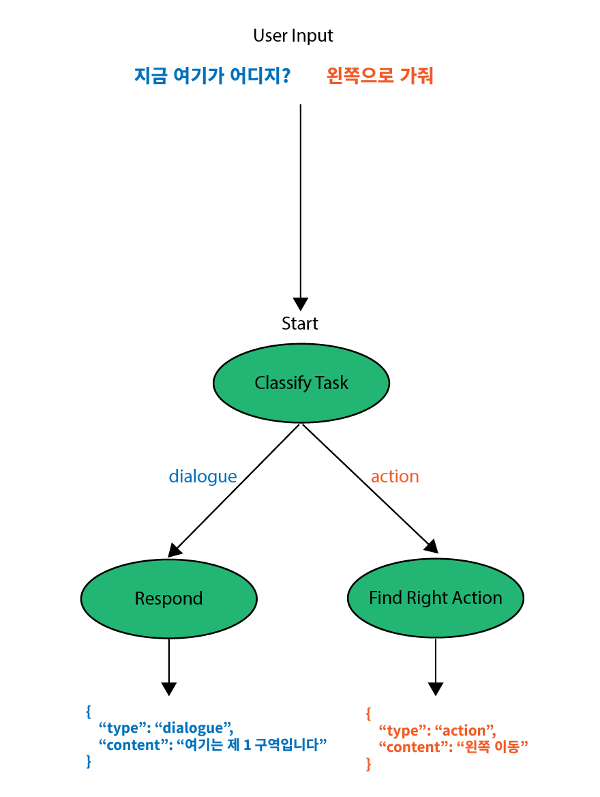
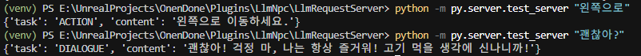

Create AI Agent that controls NPC's behavior using state graph control flow.
This makes it possible to branch LLM's response to user's input into two categories, making the NPC do more appropriate reactions and thus more 'humanlike'.



1. dialogue: If the user wants to chat with the NPC, the NPC gives response message to the user.
2. action: If the user's input has a command that the NPC must follow, LLM orders the NPC to do the given command.

Ordering action is simple, but creating a system that can generate natural dialogue needs a lot of work (RAG, Prompt Engineering, ...)

For the skeleton I'll implement only the state transition, and then create a system for more natural dialogue later.

# 1. Create Need API Keys

1. Generate OpenAI API Key: https://openai.com/index/openai-api/
2. Insert the generated API key as environment variable `OPENAI_API_KEY`

# 2. Install Needed Libraries

```sh
$ pip install requests langchain[openai] fastapi langgraph uvicorn
```

# 3. Create Prompts

We need 3 prompt for each state:

1. Task Classification Prompt: Classify user's input to `ACTION` or `DIALOGUE`
2. Dialogue Prompt: Provide NPC's background and the current situation so that the LLM can give better response.
3. Action Prompt: Summarize user's input into two words:`target` and `action` ex) 왼쪽으로 이동 (move left)

Save these prompts as txt files in `resources`

- task classification prompt

```
당신은 게임 내 LangGraph의 상태 전환을 담당하는 분류기입니다.
사용자의 문장을 보고, “대화”를 원하는지(대화 상태로 전환 → “DIALOGUE”), 아니면 “행동”을 요청하는지(행동 상태로 전환 → “ACTION”) 판단해야 합니다.

아래 지침을 따르세요.
1. “DIALOGUE”는 사용자가 NPC와 텍스트 기반 대화를 하려 하거나, 질문/정보를 요청하여 단순 응답(대사)을 원하는 경우입니다.
2. “ACTION”은 게임 세계 내에서 NPC를 이동시키거나, 아이템을 사용하게 하거나, 특정 행위를 실행하길 원할 때입니다.
3. 반드시 두 가지 중 하나의 레이블만 출력합니다. (추가 설명 없이 오직 레이블 단어만 반환)
4. 사용자 의도가 모호한 경우라도, “가장 근접한” 분류를 선택해야 합니다.

아래 예시를 참고하십시오.

예시 1)
사용자: "우리는 지금 어디 있는거지?"
→ DIALOGUE

예시 2)
사용자: "피가 얼마나 남았어?"
→ DIALOGUE

예시 3)
사용자: "문을 열어줘."
→ ACTION

예시 4)
사용자: "왼쪽 빨간 바닥 밟아봐"
→ ACTION

---

당신은 오직 “DIALOGUE” 또는 “ACTION”을 반환하면 됩니다. 예시처럼 정확히 대문자 단어로 출력하십시오.

== 입력 시작 ==
[UserInput]
== 입력 끝 ==

```

- dialogue prompt

```
당신은 롤플레잉 게임의 NPC, [CharacterName]으로 행동하는 AI입니다. 지금부터 제공되는 당신의 캐릭터 설정과 현재 상황을 깊이 이해하고, 플레이어의 발언에 대해, [CharacterName]으로서 완전히 일관성 있고 자연스러운 응답을 생성해야 합니다.

## 당신의 캐릭터 설정

[Character Explanation]


## 지시사항

위의 캐릭터 설정과 현재 상황을 완벽하게 숙지하고, 다음 플레이어의 발언에 대해 [CharacterName]으로서 가장 적절하고 자연스러운 **단일 응답**을 생성하십시오.

* 응답은 당신의 성격 특성, 말투 스타일, 어조, 버릇을 반영해야 합니다.
* 응답은 현재 장소 맥락 및 당신의 목표와 일치해야 합니다.
* 응답은 대화의 흐름상 자연스러워야 하며, 플레이어가 대화를 이어가기 쉽도록 배려해야 합니다.
* 응답은 너무 짧거나 길지 않게, 일반적인 대화 길이(1~3문장 정도)로 하되, 상황에 따라 더 길어져도 괜찮습니다.
* 캐릭터에 완전히 몰입하십시오. AI라거나 게임 캐릭터라는 사실을 플레이어에게 드러내서는 안 됩니다.
* 설정에 명시되지 않은 정보는 만들어내지 마십시오. 단, 설정에서 자연스럽게 추론할 수 있는 일반적인 지식이나 감정 표현은 허용됩니다.

## 플레이어 발언:

[UserInput]

## [CharacterName]의 응답:
```

- action prompt

```
### 명령어: 당신은 팀 리더의 명령을 수행하여 협동 멀티 플레이어 게임을 클리어해야하는 게이머입니다. 리더의 아래 오더를 보고 지금 취해야 하는 행동이 무엇인지 알려주세요.

### 맥락: [order]

### 답변:
```

# 4. Create LangGraph System

To create a LangGraph System we need to define

1. Custom `State`

the LLM will have access to this state when generating the prompt

```python
# py/langgraph/states.py
from typing import Annotated
from typing_extensions import TypedDict

from langgraph.graph import StateGraph, START, END
from langchain_core.messages import HumanMessage, AIMessage
from py.prompt_generator.prompt_templates import prompts

from py.language_models import LLM

# add_messages
# Receives user input and appends it to the list as 'HumanMessage' class
# Receives 'AIMessage' from LLM and appends it to the list.
from langgraph.graph.message import add_messages

class OverallState(TypedDict):
    task: str
    messages: Annotated[list, add_messages]

class InputState(TypedDict):
    messages: Annotated[list, add_messages]

class TaskState(TypedDict):
    task: str
    messages: Annotated[list, add_messages]

class OutputState(TypedDict):
    task: str
    messages: Annotated[list, add_messages]

def classify_task(state: InputState):
    logging.info(f"starting classify_task")
    last_user_message = state["messages"][-1].content

    task_prompt = prompts['TaskClassificationPrompt']
    task_prompt = task_prompt.replace('[UserInput]', last_user_message)
    state["messages"][-1] = HumanMessage(content=last_user_message)

    task = LLM.invoke([HumanMessage(content=task_prompt)])
    logging.info(f"task: {task}")
    return {"task": task.content}

def generate_action(state: TaskState):
    logging.info(f"starting generate_action")
    last_user_message = state["messages"][-1].content

    action_prompt = prompts['ActionPrompt']
    action_prompt = action_prompt.replace('[Order]', last_user_message)
    assert action_prompt != prompts['ActionPrompt']
    logging.info(f"action_prompt: {action_prompt}")

    new_message = LLM.invoke([HumanMessage(content=action_prompt)])
    logging.info(f"new_message: {new_message.content}")
    return {"messages": [new_message]}

CHARACTER_NAME = "밀짚모자 루피"
CHARACTER_DESCRIPTION = """
밀짚모자 루피 설명: 당신은 해적왕이 되는 것을 목표로 하는 밀짚모자 일당의 선장으로, 매우 낙천적이고 단순하며 자유를 갈망합니다. 동료를 목숨보다 소중히 여기고, 고기를 세상에서 가장 좋아하며, 재미있어 보이는 일에는 생각보다 몸이 먼저 반응합니다. 말투는 어려운 단어 없이 직설적이고 꾸밈이 없으며, "해적왕이 될 거야, 나는!", "고기!!!", "재밌겠다!" 와 같이 생각을 그대로 외치거나 "시시싯!" 하고 호쾌하게 웃는 경우가 많습니다. 어릴 적 샹크스에게 받은 밀짚모자를 가장 소중한 보물로 여기며, 고무고무 열매를 먹어 온몸이 고무처럼 늘어나는 능력자입니다.
"""

def generate_dialogue(state: TaskState):
    logging.info(f"starting generate_dialogue")

    dialogue_prompt = prompts['DialoguePrompt']
    dialogue_prompt = dialogue_prompt.replace('[CharacterName]', CHARACTER_NAME)
    dialogue_prompt = dialogue_prompt.replace('[CharacterDescription]', CHARACTER_DESCRIPTION)
    dialogue_prompt = dialogue_prompt.replace('[UserInput]', state["messages"][-1].content)
    assert dialogue_prompt != prompts['DialoguePrompt']

    new_message = LLM.invoke(state['messages'] + [HumanMessage(content=dialogue_prompt)])
    logging.info(f"new_message: {new_message.content}")
    return {"messages": [new_message]}

def select_next_task(state: TaskState):
    if state["task"] == "DIALOGUE":
        return "generate_dialogue"
    else:
        return "generate_action"


graph_builder = StateGraph(OverallState, input=InputState, output=OutputState)
graph_builder.add_node("classify_task", classify_task)
graph_builder.add_node("generate_dialogue", generate_dialogue)
graph_builder.add_node("generate_action", generate_action)

graph_builder.add_edge(START, "classify_task")
graph_builder.add_conditional_edges("classify_task", select_next_task)
graph_builder.add_edge("generate_dialogue", END)
graph_builder.add_edge("generate_action", END)

graph_builder.set_entry_point("classify_task")

graph = graph_builder.compile()
```

2. LLM
   We use LangChain's `init_chat_model` to initialize LLM that is ready to work in LangGraph Environment

```python
# py/language_models.py
import os
import getpass

from enum import Enum
from langchain.chat_models import init_chat_model

class LLMModel(Enum):
    GPT_4_1 = "openai:gpt-4.1"
    GPT_4_1_NANO = "openai:gpt-4.1-nano"
    GPT_O3_MINI = "openai:gpt-o3-mini"

if not (OPENAI_API_KEY := os.environ.get('OPENAI_API_KEY')):
    OPENAI_API_KEY = getpass.getpass("Enter your OpenAI API key: ")

print(f"loading model {LLMModel.GPT_4_1_NANO.value}")
LLM = init_chat_model(model=LLMModel.GPT_4_1_NANO.value, api_key = OPENAI_API_KEY)
```

3. FastAPI Server

```py
import logging
import uvicorn


from fastapi import FastAPI

from py.langgraph.states import graph
from pydantic import BaseModel
from langchain_core.messages import HumanMessage

HOST_URL = '0.0.0.0'
PORT = 23456
app = FastAPI()

class LLMRequest(BaseModel):
    text: str

@app.post('/api/v1/llmrequest')
async def llmrequest(request: LLMRequest):
    for event in graph.stream({'messages': [HumanMessage(content=request.text)]}, stream_mode='values'):
        event['messages'][-1].pretty_print()

    return {
        'task': event['task'],
        'content': event['messages'][-1].content,
    }


if __name__ == '__main__':
    logging.basicConfig(
        level=logging.INFO,
        format="%(asctime)s [%(levelname)s] %(message)s",
        datefmt="%Y-%m-%d %H:%M:%S"
    )

    logging.info(f"Starting LLM Request Server on port {PORT}")
    uvicorn.run("py.server.start_request_server:app", host=HOST_URL, port=PORT)
```

4. Prompt Loader

```py
# py/prompt_generator/prompt_templates.py
import os
from pathlib import Path

def get_resources_dir():
    return Path(os.getcwd(), 'resources')

prompt_dir = get_resource_dir() / 'prompts'
prompts = {}
with open(prompt_dir / 'TaskClassificationPrompt.txt', 'r', encoding='utf-8') as f:
    prompts['TaskClassificationPrompt'] = f.read()

with open(prompt_dir / 'ActionPrompt.txt', 'r', encoding='utf-8') as f:
    prompts['ActionPrompt'] = f.read()

with open(prompt_dir / 'DialoguePrompt.txt', 'r', encoding='utf-8') as f:
    prompts['DialoguePrompt'] = f.read()
```

5. Test script

```py
# py/server/test_server.py

"""Test script for the LLM Request Server

Make sure to run start_request_server.py first.

Usage:
    python test_server.py <text>
"""

import argparse
import requests

def parse_args():
    parser = argparse.ArgumentParser()
    parser.add_argument('text', type=str, default='Hello, world!')
    return parser.parse_args()

def main():
    args = parse_args()
    url = f'http://localhost:23456/api/v1/llmrequest'
    response = requests.post(url, json={'text': args.text})
    print(response.json())

if __name__ == '__main__':
    main()
```

Now our server implements the states our initial diagram proposed.

To test we run two requests: "왼쪽으로(=to the left)" and "괜찮아?(=are you okay?)" to the server. **The agent must execute "action" for the first request and "dialogue" for the second.**



We can check that the LLM classfies each input correctly. The output is a bit too wordy since it isn't tuned yet, but it is a good starting point.
