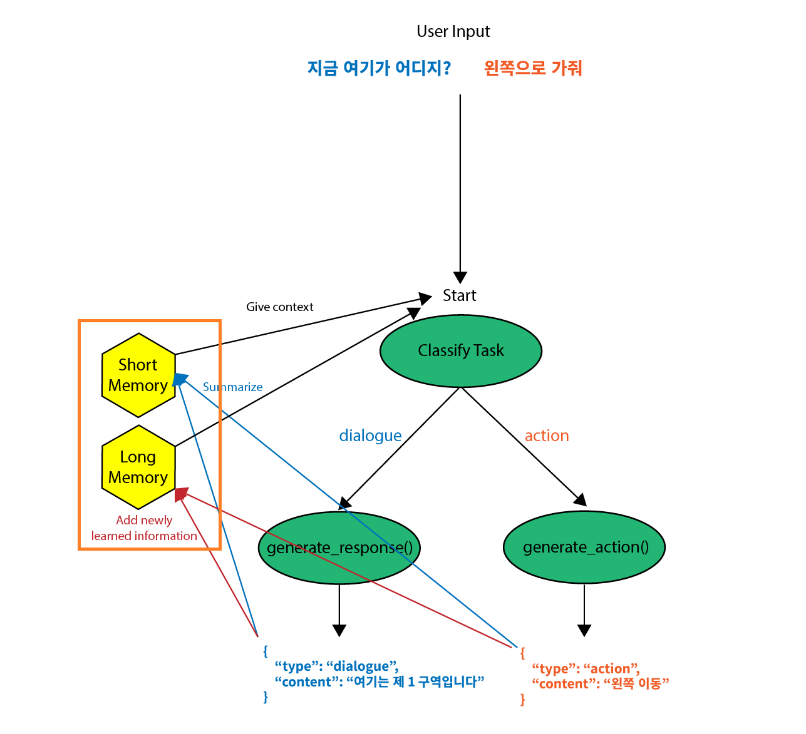

Now we have a basic StateGraph model that records the message log of the conversation with the user.

However, there are two things that can be done better:

1. States are volatile - **they vanish when the server shuts down.**
2. If the conversation gets too long, the prompt will be way too long for the LLM to handle correctly -> **constantly summarize the conversation to get only the important parts**

3. can be solved using `long term memory` and 2 can be solve using `short term memory`

Next I'm going to add a tool to the agent to show how tool features are added in LangGraph.

