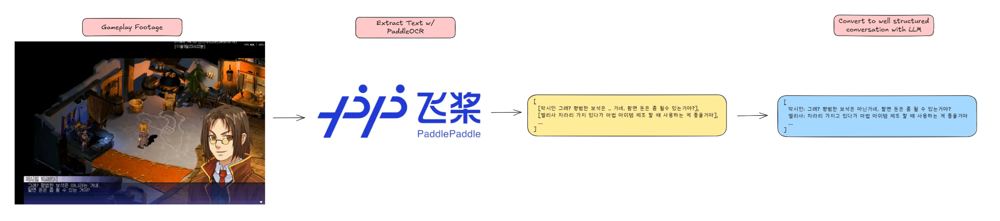

Making language models imitate a character is called `persona tuning`. I'm going to see if I can fine-tune an sLM to imitate a character I like and have a real-time conversation.

# Crawling Conversation Data From Gameplay Footage



- I don't want to create fine-tuning dataset by hand, so I will extract raw dialogue text from recorded gameplay footage and ask the LLM to finish the incomplete parts.

We need to use PaddleOCRv4, since Korean isn't supported for v5 yet.

```toml
# pyproject.toml

[build-system]
requires = ["setuptools>=61.0", "wheel"]
build-backend = "setuptools.build_meta"

[project]
name = "game-text-extractor"
version = "0.1.0"
description = "Video text extraction tool using PaddleOCR"
requires-python = ">=3.8"
dependencies = [
    "opencv-python>=4.8.0",
    "paddlepaddle==3.0.0",
    "paddleocr<3.0.0",
    "numpy==2.3.1"
]

[project.scripts]
extract-game-text = "game_text_extractor.extract_game_text:main"

[tool.setuptools.packages.find]
where = ["."]
include = ["game_text_extractor*"]
```

```py
"""Extracts text from video frames in given interval using PaddleOCR.

Usage example:
    python extract_game_text.py --video_path ./ep1-2.mp4 --output_dir ./output --frame_interval 5
"""

import cv2
import os
from paddleocr import PaddleOCR
from datetime import datetime
import argparse
import json
from pathlib import Path

def parse_args():
    parser = argparse.ArgumentParser(description='Video Text Extractor')
    parser.add_argument('--video_path', type=str, required=True, help='Path to the video file')
    parser.add_argument('--output_dir', type=str, default='extracted_frames', help='Output directory for extracted frames')
    parser.add_argument('--frame_interval', type=int, default=5, help='Frame interval for text extraction')
    return parser.parse_args()

class VideoTextExtractor:
    def __init__(self, confidence_threshold=0.8):
        self.ocr = PaddleOCR(lang='korean', show_log=False)
        self.confidence_threshold = confidence_threshold

    def extract_frames_and_text(self, video_path, frame_interval, output_dir):
        """영상에서 텍스트 추출"""

        os.makedirs(output_dir, exist_ok=True)

        cap = cv2.VideoCapture(video_path)

        if not cap.isOpened():
            print(f"Error: 비디오 파일을 열 수 없습니다: {video_path}")
            return []

        # 비디오 정보
        fps = cap.get(cv2.CAP_PROP_FPS)
        total_frames = int(cap.get(cv2.CAP_PROP_FRAME_COUNT))
        duration = total_frames / fps

        print(f"비디오 정보:")
        print(f"- FPS: {fps}")
        print(f"- 총 프레임: {total_frames}")
        print(f"- 길이: {duration:.2f}초")
        print(f"- {frame_interval}프레임마다 추출 예정")

        extracted_texts = []
        frame_count = 0
        saved_count = 0

        while True:
            ret, frame = cap.read()

            if not ret:
                break

            if frame_count % frame_interval == 0:
                timestamp = frame_count / fps
                frame_filename = f"frame_{saved_count:06d}_t{timestamp:.2f}s.jpg"
                frame_path = os.path.join(output_dir, frame_filename)
                cv2.imwrite(frame_path, frame)

                try:
                    result = self.ocr.ocr(frame_path, cls=True)

                    frame_texts = []
                    if result[0]:
                        for line in result[0]:
                            text = line[1][0]
                            confidence = line[1][1]
                            bbox = line[0]

                            if confidence >= self.confidence_threshold:
                                frame_texts.append(text)

                    extracted_data = {
                        'texts': frame_texts,
                    }

                    extracted_texts.append(extracted_data)

                    if frame_texts:
                        print(f"Frame {saved_count} ({timestamp:.2f}s): {len(frame_texts)}개 텍스트 발견")
                        for text_info in frame_texts:
                            print(f"  - {text_info['text']} (신뢰도: {text_info['confidence']:.2f})")
                    else:
                        print(f"Frame {saved_count} ({timestamp:.2f}s): 텍스트 없음")

                    saved_count += 1

                except Exception as e:
                    print(f"OCR 처리 오류 (Frame {saved_count}): {e}")

            frame_count += 1

        cap.release()

        result_file = os.path.join(output_dir, "extraction_results.json")
        with open(result_file, 'w', encoding='utf-8') as f:
            json.dump(extracted_texts, f, ensure_ascii=False, indent=2)

        print(f"\n추출 완료!")
        print(f"- 총 {saved_count}개 프레임 처리")
        print(f"- 결과 저장 위치: {result_file}")

        return extracted_texts

if __name__ == "__main__":
    args = parse_args()
    extractor = VideoTextExtractor(confidence_threshold=0.8)
    results = extractor.extract_frames_and_text(**vars(args))
```

This script extracts frames from the video in given interval, and makes PaddleOCR extract the texts.
