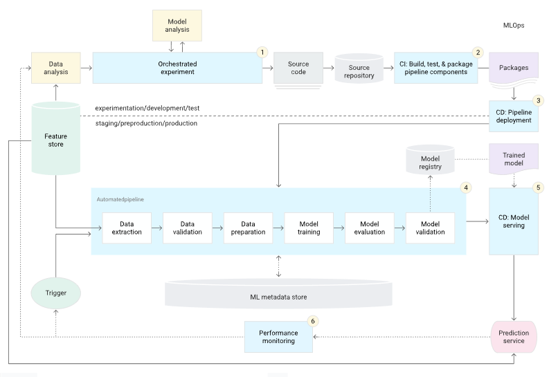
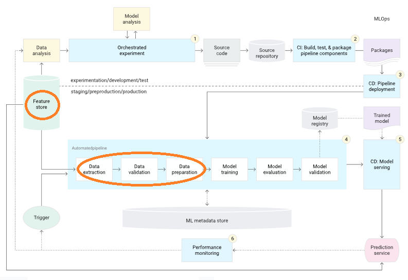

Applying right practices is becoming more important in ML projects, and MLOps is the key to achieving this good practice.

# MLOps

ML projects are no doubt **the biggest scale projects in software engineering history: Large data, numerous iterations and experiments.**

That's why correct project cycle management is crucial for an ML project to succeed: better management cycle, more iterations, better output.

- Processing and Versioning Data
- analyzing data(EDA)
- model training/management/versioning
- deployment and continuous training

#### example of an MLOps system

## 1. Implementing Data Pipeline

I'm first going to try implementing the initial stages of the MLOps pipeline:

There are two popular ways to create a data process pipeline: `airflow` and `kubeflow`. Airflow is more popular because it's easier to use, but since I've used Airflow before I'll be trying out Kubeflow with Google Cloud Platform.

# Installing Google Cloud Platform
