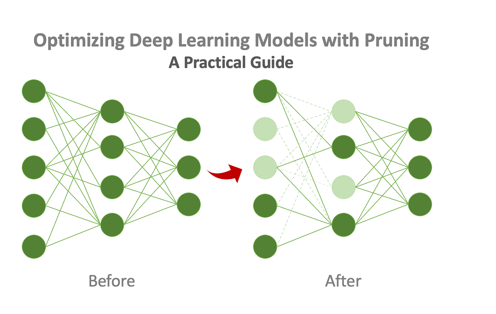

Model compression techniques are methods to decrease model size while minimizing performance degradation.

1. Big models such as LLMs with >7B parameters need too much resource to run in realtime
   - ex) My V100 GPU has insufficient VRAM to run a medium 5.8B LLM
2. Some projects just can't afford that much resource, and some projects require very high latency.

We use model compression to create a smaller model that fits the project's resource and latency requirements while not downgrading the model's performance too much.

## 1. Pruning



- https://miro.medium.com/v2/resize:fit:1400/1*6skjudfW25iAbd8uryVH6A.png

1. **Deletes weights that are close to 0**

- Weights in layer that are close to 0 means **these weights have almost no effect in producing the model's output**.
- Weights less than a certain threshold are deleted, and thus the GPU doesn't have to put those weights in the memory.

## 2. Quantization


- https://www.digitalocean.com/community/tutorials/model-quantization-large-language-models

There's many ways of quantizing, but the simplest way is uniform quantization

1. get min/max value of a layer
2. divide the [min, max] area into 256 uniform areas and assign each weight to the area it is in.

### Activation Quantizations

Quantization is done not only on weights, but also the activation.

- Weight is always quantized statically.
- There is Static/Dynamic quantization for activation. Static is the more difficult one (need calibration layer).


### Quantization Training

- Post Training Quantization: perform on an already trained model - simple but more performance loss
- Quantization Aware Training: Train with quantization simluation - complex but less perfomance loss

### Quantization in Huggingface

# Quantization Using bitsandbytes

To quantize the model in huggingface we need `bitsandbytes` library
However pip version of bitsandbytes doesn't work when downloaded in an environment with CUDA>=12.4

- https://github.com/bitsandbytes-foundation/bitsandbytes/issues/1152

So we need to build `bitsandbytes` library from source

```sh
$ git clone https://github.com/bitsandbytes-foundation/bitsandbytes.git

$ cd bitsandbytes
$ cmake -DCOMPUTE_BACKEND=cuda -S .
$ make
$ pip install .
```

## 3. Knowledge Distillation

Transfer big model's knowledge to smaller model

- Full distillation: Transfer not only the highest value but **the whole distribution of the teacher model**
  - Very effective but must have access of the model source most of the time.
- Weak distillation: Transfer only the highest value(=inference result)
  - Not ideal but the only way when we have limited access.
