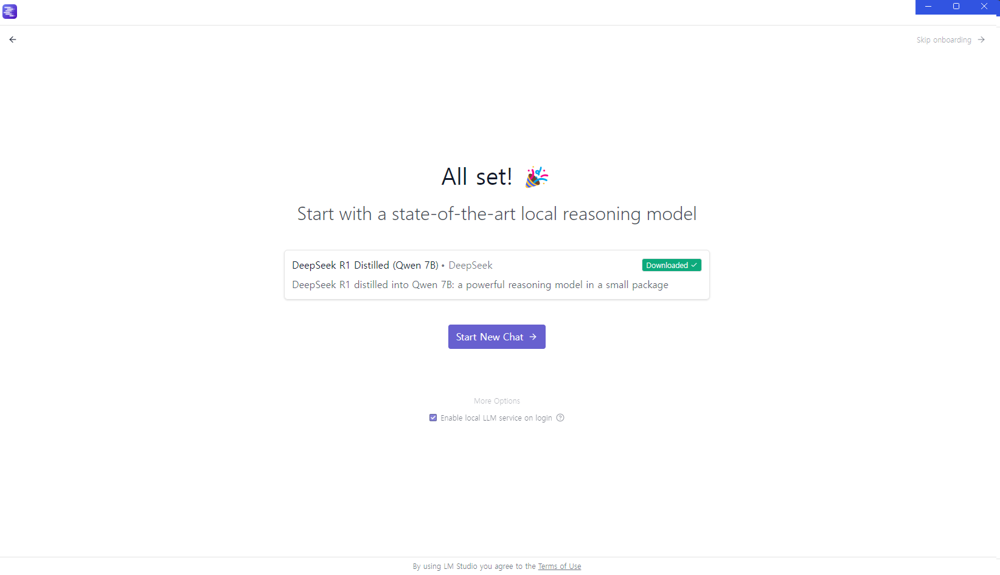

I'm working on a story evaluation AI Agent. I'm going to tune the model using Langchain with a local LLM using LM Studio

# 1. Setting up LM Studio

Tool for downloading and running local LLM model that fits your local environment.

- Download: https://lmstudio.ai/
- Install and we'll be asked to download Qwen B7 for onboarding.


After downloading, we can run the model



Run the model and we'll se a chatbot environment pop up.

- click on `load model` on the bottom right pop up screen.


Now we can send messages to check that the model works well


Doing some vibe check, it seems like it doesn't understand Korean well. From now I'll proceed using English in the prompt.


# 2. Testing API

When we deploy our model locally, we can see from the script that it uses port 1234 as default:


We can use the OpenAI API to get response from our string

```python
from openai import OpenAI

from tqdm import tqdm
import pickle

client = OpenAI(
    api_key="API_KEY", # any random string since we're hosting our own model
    base_url="http://localhost:1234"
)

movies_char_responses = []
tvs_char_responses = []

client.chat.completions.create(
	model="deepseek-r1-distill-qwen-7b",
    messages="test",
    temperature=0.2,
    max_tokens=15000
)
```
