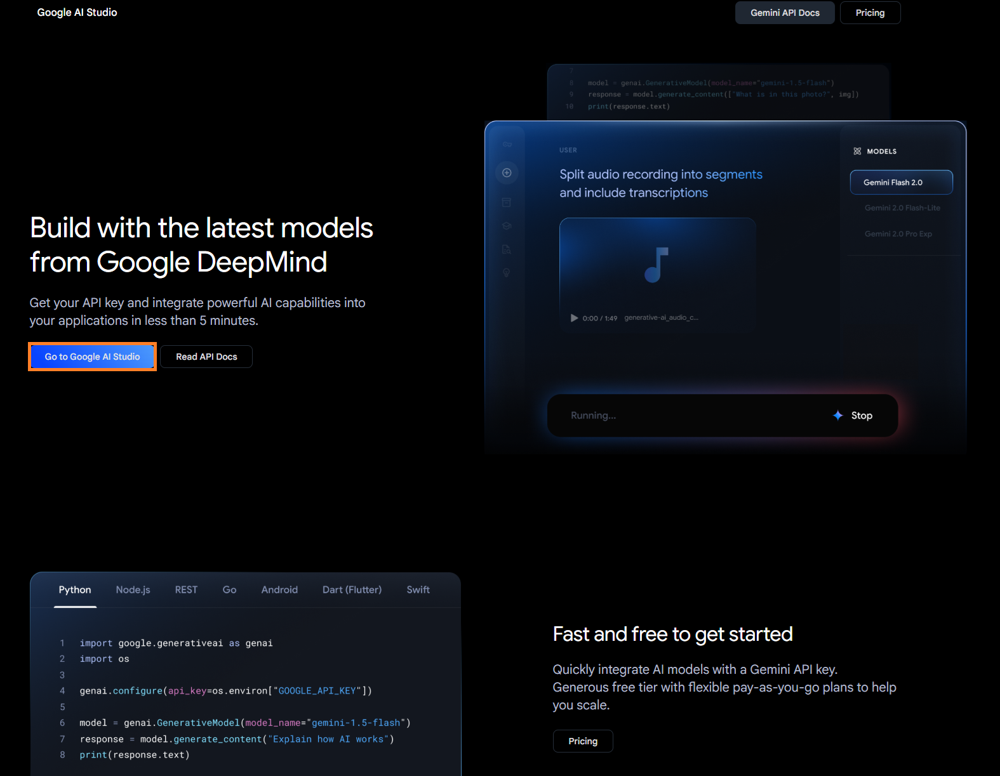
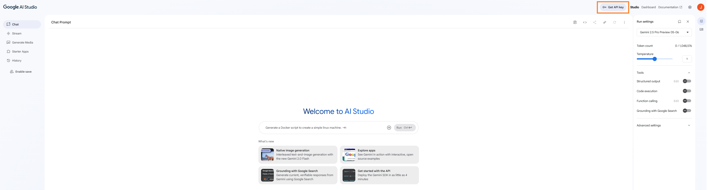
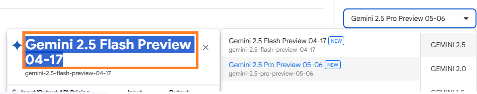
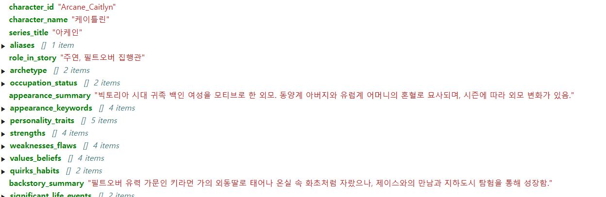
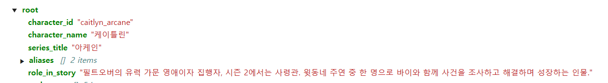

Scraping data will give us large volume of data in small time, but we need a way more structured type of data
for the model to process if we're going to use this data in the RAG dataset.

Summarizing this data by hand will take a very long time, so we will use the LLM to summarize our scraped data for us.

# Coming up with a good data structure

Funnily, one of the best usage of LLM is **to as how to better use an LLM in a project.**

1. I asked LLM **the best format to structure my data to use for RAG vector DB, and it recommended me the following format in JSON:**

```json
{
  "character_id": "unique_character_identifier_string",
  "character_name": "캐릭터 이름 (String)",
  "series_title": "작품 제목 (String)",
  "aliases": ["별명1 (String)", "다른 이름2 (String)"],
  "role_in_story": "스토리 내 역할 (String)",
  "archetype": ["원형1 (String)", "원형2 (String)"],
  "occupation_status": ["직업/신분1 (String)", "직업/신분2 (String)"],

  "appearance_summary": "외모 및 주요 신체적 특징에 대한 간략한 서술 (String)",
  "appearance_keywords": ["외모 키워드1 (String)", "외모 키워드2 (String)"],

  "personality_traits": ["성격 특성1 (String)", "성격 특성2 (String)"],
  "strengths": ["강점1 (String)", "강점2 (String)"],
  "weaknesses_flaws": ["약점/결점1 (String)", "약점/결점2 (String)"],
  "values_beliefs": ["가치관/신념1 (String)", "가치관/신념2 (String)"],
  "quirks_habits": ["특이점/습관1 (String)", "특이점/습관2 (String)"],

  "backstory_summary": "캐릭터의 배경 이야기 및 그를 형성한 주요 과거 경험에 대한 요약 (String)",
  "significant_life_events": [
    // 캐릭터의 삶/성격에 전환점이 된 사건 (과거, 현재 포함)
    {
      "event_name": "결정적 사건명1 (String)",
      "event_description": "사건이 캐릭터에게 미친 영향 및 간략한 설명 (String)",
      "timeline_tag": "시기 (String)", // 예: "어린 시절", "ISSP 재직 중", "비밥 호 합류 직후"
      "related_characters": ["관련 캐릭터명1", "관련 캐릭터명2"]
    }
  ],

  "major_in_story_actions": [
    // 작품의 주요 플롯 내에서 캐릭터가 수행한 행동/사건 (시간 순서나 중요도에 따라)
    {
      "arc_or_episode": "관련 에피소드/챕터/스토리 아크명 (String)", // 예: "세션 #5", "가니메데 비가 편", "붉은 눈의 악마 아크"
      "action_summary": "캐릭터의 주요 행동이나 역할에 대한 요약 (String)", // 예: "현상범 A를 추적하고 체포하는 데 결정적인 단서를 제공했다.", "동료 B를 구하기 위해 위험을 무릅썼다."
      "outcome_or_impact": "해당 행동의 결과나 스토리에 미친 영향 (String, Optional)", // 예: "현상금 획득에 기여", "캐릭터 C와의 관계가 깊어짐"
      "related_characters": ["관련 캐릭터명1", "관련 캐릭터명2"]
    }
  ],

  "motivations_goals": {
    "primary_motive": "가장 핵심적인 동기 (String)",
    "other_motives": ["기타 동기1 (String)", "기타 동기2 (String)"],
    "short_term_goals": ["단기 목표1 (String)", "단기 목표2 (String)"],
    "long_term_goals": ["장기 목표1 (String)", "장기 목표2 (String)"]
  },

  "relationships": [
    {
      "related_character_name": "관계 대상 캐릭터 이름 (String)",
      "relationship_type": "관계 유형 (String)",
      "relationship_description": "관계에 대한 간략한 설명 및 캐릭터에게 미치는 영향 (String)"
    }
  ],

  "abilities_skills": ["능력/기술1 (String)", "능력/기술2 (String)"],
  "key_quotes": ["대표적인 대사1 (String)", "대표적인 대사2 (String)"],
  "thematic_representation": [
    "상징하는 주제1 (String)",
    "상징하는 주제2 (String)"
  ],
  "character_arc_summary": "캐릭터의 성장 및 변화 과정에 대한 요약 (String)",
  "tags_keywords": ["태그1 (String)", "태그2 (String)"]
}
```

2. I asked the LLM for a good prompt that will give summarization of my given text in the recommened JSON format

```
당신은 제공된 캐릭터 설명 텍스트를 분석하여 지정된 JSON 형식으로 핵심 정보를 요약하고 구조화하는 AI 어시스턴트입니다.

[캐릭터 설명 텍스트 시작]
{여기에_긴_캐릭터_설명_텍스트_입력}
[캐릭터 설명 텍스트 끝]

위 텍스트를 바탕으로 다음 JSON 형식에 맞춰 각 항목을 채워주세요. 각 필드에는 텍스트에서 관련된 핵심 정보만을 간결하게 요약하여 넣어주세요. 만약 특정 필드에 해당하는 내용이 텍스트에 명확히 언급되지 않았다면, 해당 필드 값은 null로 처리하거나 빈 배열([]) 또는 빈 문자열("")로 남겨주세요.

[요청 JSON 형식 시작]
{
  "character_id": "텍스트에서 유추 가능한 ID 또는 작품명_캐릭터명",
  "character_name": "캐릭터 이름",
  "series_title": "작품 제목",
  "aliases": [],
  "role_in_story": "스토리 내 역할",
  // ... (이전에 논의된 전체 JSON 필드 구조) ...
  "major_in_story_actions": [
    {
      "arc_or_episode": "",
      "action_summary": "",
      "outcome_or_impact": "",
      "related_characters": []
    }
  ],
  // ... (나머지 JSON 필드 구조) ...
  "tags_keywords": []
}
[요청 JSON 형식 끝]

반드시 위 JSON 형식과 필드명을 정확히 따라서 결과를 생성해주세요.

```

# Asking High Performance LLM for Summarization(Gemini 2.5-flash)

Quality of our data is very important, so we will use Gemini 2.5-flash to summarize our dataset.
Also, we can't use chatbot if we want the LLM to summarize datasets because we'll have to input every data into the chat by hand.

Thus **we need to set up a Google API Key and request using API.**

## 1. Get a Google AI API Key

We can generate API key in Google's AI Studio





## 2. Make Script to Request Summarization for All Files

Copy the API Key and use it in our Python script to request to Gemini

```sh
pip install google-generativeai
```

## 2-1. Prompt Generation

```python
import google.generativeai as genai
import os
import json

import google.generativeai as genai # genai 임포트 추가
import os
import json # json 임포트 추가 (이미 main 함수 내에 있지만, 전역에서도 사용)
from tqdm import tqdm
from pathlib import Path

def get_summarize_prompt(file_path):
    with open(file_path, 'r', encoding='UTF8') as f:
        content = f.read()

    prompt = f"""
당신은 제공된 캐릭터 설명 텍스트를 분석하여 지정된 JSON 형식으로 핵심 정보를 요약하고 구조화하는 AI 어시스턴트입니다.

[캐릭터 설명 텍스트 시작]\n
{content}
[캐릭터 설명 텍스트 끝]

위 텍스트를 바탕으로 다음 JSON 형식에 맞춰 각 항목을 채워주세요. 각 필드에는 텍스트에서 관련된 핵심 정보만을 간결하게 요약하여 넣어주세요. 만약 특정 필드에 해당하는 내용이 텍스트에 명확히 언급되지 않았다면, 해당 필드 값은 null로 처리하거나 빈 배열([]) 또는 빈 문자열("")로 남겨주세요.

[요청 JSON 형식 시작]
{{
  "character_id": "unique_character_identifier_string",
  "character_name": "캐릭터 이름 (String)",
  "series_title": "작품 제목 (String)",
  "aliases": ["별명1 (String)", "다른 이름2 (String)"],
  "role_in_story": "스토리 내 역할 (String)",
  "archetype": ["원형1 (String)", "원형2 (String)"],
  "occupation_status": ["직업/신분1 (String)", "직업/신분2 (String)"],
  "appearance_summary": "외모 및 주요 신체적 특징에 대한 간략한 서술 (String)",
  "appearance_keywords": ["외모 키워드1 (String)", "외모 키워드2 (String)"],
  "personality_traits": ["성격 특성1 (String)", "성격 특성2 (String)"],
  "strengths": ["강점1 (String)", "강점2 (String)"],
  "weaknesses_flaws": ["약점/결점1 (String)", "약점/결점2 (String)"],
  "values_beliefs": ["가치관/신념1 (String)", "가치관/신념2 (String)"],
  "quirks_habits": ["특이점/습관1 (String)", "특이점/습관2 (String)"],
  "backstory_summary": "캐릭터의 배경 이야기 및 그를 형성한 주요 과거 경험에 대한 요약 (String)",
  "significant_life_events": [
    {{
      "event_name": "결정적 사건명1 (String)",
      "event_description": "사건이 캐릭터에게 미친 영향 및 간략한 설명 (String)",
      "timeline_tag": "시기 (String)",
      "related_characters": ["관련 캐릭터명1", "관련 캐릭터명2"]
    }}
  ],
  "major_in_story_actions": [
    {{
      "arc_or_episode": "관련 에피소드/챕터/스토리 아크명 (String)",
      "action_summary": "캐릭터의 주요 행동이나 역할에 대한 요약 (String)",
      "outcome_or_impact": "해당 행동의 결과나 스토리에 미친 영향 (String, Optional)",
      "related_characters": ["관련 캐릭터명1", "관련 캐릭터명2"]
    }}
  ],
  "motivations_goals": {{
    "primary_motive": "가장 핵심적인 동기 (String)",
    "other_motives": ["기타 동기1 (String)", "기타 동기2 (String)"],
    "short_term_goals": ["단기 목표1 (String)", "단기 목표2 (String)"],
    "long_term_goals": ["장기 목표1 (String)", "장기 목표2 (String)"]
  }},
  "relationships": [
    {{
      "related_character_name": "관계 대상 캐릭터 이름 (String)",
      "relationship_type": "관계 유형 (String)",
      "relationship_description": "관계에 대한 간략한 설명 및 캐릭터에게 미치는 영향 (String)"
    }}
  ],
  "abilities_skills": ["능력/기술1 (String)", "능력/기술2 (String)"],
  "key_quotes": ["대표적인 대사1 (String)", "대표적인 대사2 (String)"],
  "thematic_representation": ["상징하는 주제1 (String)", "상징하는 주제2 (String)"],
  "character_arc_summary": "캐릭터의 성장 및 변화 과정에 대한 요약 (String)",
  "tags_keywords": ["태그1 (String)", "태그2 (String)"]
}}
[요청 JSON 형식 끝]

반드시 위 JSON 형식과 필드명을 정확히 따라서 결과를 생성해주세요.
    """
    return prompt


```

## 2-2. API Request

Use the model name of the latest Gemini 2.5 flash



```python
def main_gemini_process(input_text_file_path):
    try:
        api_key = <API_KEY>

        if not api_key:
            print("🔴 GOOGLE_API_KEY가 설정되지 않았습니다.")
            return None
        genai.configure(api_key=api_key)
    except Exception as e:
        print(f"🔴 API 키 설정 중 오류 발생: {e}")
        return None

    try:
        generation_config = genai.types.GenerationConfig(
            response_mime_type="application/json"
        )
        model = genai.GenerativeModel(
            model_name='gemini-2.5-flash-preview-04-17',
            generation_config=generation_config
        )
    except Exception as e:
        print(f"🔴 Gemini 모델 초기화 중 오류 발생 (파일: {input_text_file_path}): {e}")
        return None

    try:
        prompt_text = get_summarize_prompt(input_text_file_path) # 함수 인자로 받은 파일 경로 사용
    except FileNotFoundError:
        print(f"🔴 프롬프트 생성을 위한 파일 '{input_text_file_path}'을(를) 찾을 수 없습니다.")
        return None
    except Exception as e:
        print(f"🔴 프롬프트 생성 중 오류 (파일: {input_text_file_path}): {e}")
        return None

    print(f"🚀 '{model.model_name}' 모델에 요약 요청 (파일: {input_text_file_path})...")
    parsed_json_output = None
    try:
        response = model.generate_content(prompt_text)
        json_response_text = response.text

        try:
            parsed_json_output = json.loads(json_response_text)
        except json.JSONDecodeError as e:
            print(f"\n⚠️ LLM 응답이 유효한 JSON 형식이 아닙니다 (파일: {input_text_file_path}). 오류: {e}")
            print("   로우 응답 내용:")
            print(json_response_text)
            return {"error": "Invalid JSON response", "raw_text": json_response_text}
        except Exception as e:
            print(f"\n🔴 JSON 파싱 중 예상치 못한 오류 발생 (파일: {input_text_file_path}): {e}")
            return None

    except Exception as e:
        print(f"🔴 Gemini API 요청 중 오류 발생 (파일: {input_text_file_path}): {e}")
        if hasattr(e, 'message'):
            print(f"   오류 메시지: {e.message}")

        if "429" in str(e) or "Resource has been exhausted" in str(e):
            print("   API 요청 한도 초과 가능성이 있습니다. 잠시 후 다시 시도하거나 할당량을 확인하세요.")
            return {"error": "Rate limit likely exceeded", "details": str(e)}
        return None

    return parsed_json_output
```

## 2-3. Iterate through files in directory and request summarization

```python

if __name__ == "__main__":
    source_dir = './datasets/'
    output_dir = './datasets/output'

    Path(output_dir).mkdir(parents=True, exist_ok=True)

    text_files_to_process = [
        file_name for file_name in os.listdir(source_dir)
        if file_name.endswith('character.txt')
    ]

    print(f"총 {len(text_files_to_process)}개의 캐릭터 파일을 처리합니다.")

    for text_file_name in tqdm(text_files_to_process, desc="캐릭터 파일 처리 중"):
        full_text_file_path = os.path.join(source_dir, text_file_name)

        text_file_stem = Path(full_text_file_path).stem
        if f"{text_file_stem}.json" in os.listdir(output_dir):
            continue

        parsed_json_data = main_gemini_process(full_text_file_path)

        if parsed_json_data:
            if "error" in parsed_json_data:
                print(f"⚠️ {text_file_name} 처리 중 오류 발생: {parsed_json_data.get('error')}")
            else:
                output_json_file_name = Path(text_file_name).stem + '.json'
                output_json_file_path = os.path.join(output_dir, output_json_file_name)

                try:
                    with open(output_json_file_path, 'w', encoding='UTF8') as f:
                        json.dump(parsed_json_data, f, ensure_ascii=False, indent=2)
                    print(f"✅ {output_json_file_path} 파일로 저장 완료.")
                except Exception as e:
                    print(f"🔴 {output_json_file_path} 파일 저장 중 오류 발생: {e}")
        else:
            print(f"🟡 {text_file_name} 처리 결과가 없습니다 (None 반환됨).")

    print("모든 파일 처리가 완료되었습니다.")
```

- I tried using Gemini 1.5 and compared the results, but 2.5 shows way better result, so it's better to use higher versions for static prompt task such as collecting data.

  - gemini 1.5
    

  - gemini 2.5
    
