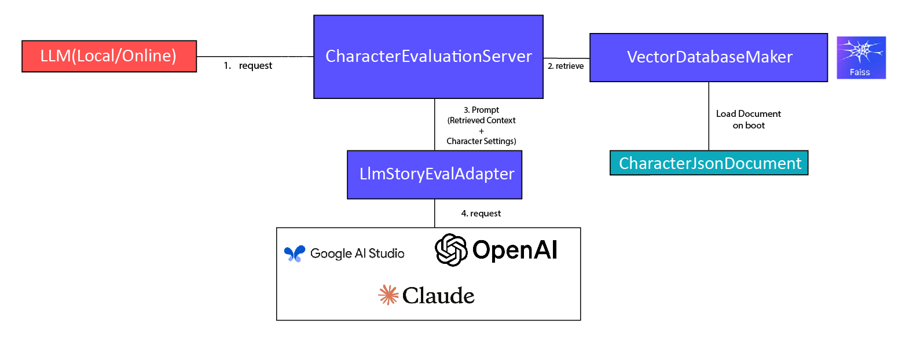

While Gemini summarizes my dataset, I'll be creating an LLM server skeleton to use in the project.

# Backend Model Structure



We're going to provide an LLM Adapter so that we can easily transfer from local smaller LLM and larger LLM hosted by bigger companies

# LLM Request Adapter

```python
"""Provides API for requesting Online and Offline LLM Character Evaluation
"""

from abc import abstractmethod

class LlmCharacterEvalAdapter:
    @abstractmethod
    def get_character_evaluation_from_llm(self, character_eval_request) -> CharacterEvalResponse:
        """Request Character Evaluation to the target LLM with the given request format.

        Args:
            character_eval_request: must be a string in json format

        Returns:
            CharacterEvalResponse
        """
        pass
```

I implemented Adapters for OpenAI and Google AI

```python
# openai.py

from llm_adapter.llm_character_eval_adapter import LlmCharacterEvalAdapter
from openai import OpenAI
from dataclasses import dataclass

@dataclass
class OpenAiLlmResponseConfigs:
    temperature: float = 0.7
    max_tokens: Optional[int] = None

class OpenAiApiAdapter(LlmCharacterEvalAdapter):
    """Adapter for LLMs that use OpenAI API

    1) if host url is not provided the Adapter assumes the LLM is running on localhost
    2) if the LLM is running on a localhost, port of the running LLM is required
    3) api_key is required only for online LLMs

    kwargs:
        temperature: float, must be between 0.0 and 1.0
        max_tokens: int, must be greater than 0
    """
    def __init__(self, model_name: str, host_url: Optional[str] = None, port: Optional[int] = None, api_key: Optional[str] = None, **kwargs):
        if host_url is not None and api_key is None:
            raise ValueError("API key is required when using online LLM")

        if host_url is None and port is None:
            raise ValueError("Port is required when using local LLM")

        base_url = f"http://localhost:{port}/v1" if host_url is None else host_url
        self.client = OpenAI(base_url=base_url, api_key=api_key)
        self.response_configs = OpenAiLlmResponseConfigs(**kwargs)


    def get_character_evaluation_from_llm(self, character_eval_request) -> CharacterEvalResponse:
        messages = [
            { "role": "system", "content": self._create_context_prompt() },
            { "role": "user", "content": self._create_user_prompt(str(character_eval_request)) }
        ]

        response = self.client.chat.completions.create(
            model=self.model_name,
            messages=messages,
            temperature=self.response_configs.temperature,
            max_tokens=self.response_configs.max_tokens
        )

        return response.choices[0].message.content


# gemini.py

import json
import google.generativeai as genai

from llm_adapter.llm_character_eval_adapter import LlmCharacterEvalAdapter

class GoogleApiAdapter(LlmCharacterEvalAdapter):
    """Adapter for LLMs that use Google API

    Gemini can't be hosted locally, so adapter assumes the API will be requested to Google's AI Studio model.
    """

    def __init__(self, api_key: str, model_name: str = "gemini-1.5-flash-latest"):
        assert self.api_key is not None, "API key is required for Gemini API"

        genai.configure(api_key=api_key)
        self.generation_config = genai.GenerativeModelConfig(response_mime_type="application/json")

        try:
            self.model = genai.GenerativeModel(self.model_name, generation_config=self.generation_config)
        except Exception as e:
            raise ValueError(f"Failed to create Gemini model: {model_name}")


    def get_character_evaluation_from_llm(self, character_eval_request):
        json_response = None
        response_string = None

        message = self._create_context_prompt(character_eval_request) + "\n\n" + self._create_user_prompt(character_eval_request)
        while json_response := json.loads(response_string):
            response = self.model.generate_content(message)
            response_string = response.text

        return json_response
```

# Vector DB Maker

Create Vector DB after receiving list of json files that will be inserted into the Vector Database.
There will be another class responsible for getting the list of json files, since I want the option to loading data from local directory or cloud storage.

```python
import json
from pathlib import Path
from abc import abstractmethod
from langchain_core.documents import Document
from langchain_text_splitters import RecursiveCharacterTextSplitter
from llm_summarization.vector_database.parse_to_document_text import convert_json_data_list_to_documents
from tqdm import tqdm

class VectorDbMaker:
    """Abstract class for making vector database that will be used for the character evaluation server.

    Implement this class for different vector database and implement the specific vector database's creation logic.
    """

    def make_vector_db(self, json_data_files: list[str]):
        documents = self._load_json_data_files(json_data_files)
        return self._create_vector_db(documents)

    @abstractmethod
    def create_vector_db(self, documents):
        pass

    def _load_json_data_files(self, json_data_files: list[str]):
        """Load json data files and return list of dictionaries.
        """

        json_data_list = []

        for json_data_file in tqdm(json_data_files, desc="Loading JSON data files"):
            with open(json_data_file, 'r', encoding='utf-8') as f:
                data = json.load(f)

                if type(data) == list:
                    data = data[0]

                document = convert_json_data_list_to_documents(data)
                json_data_list.append(document)

        text_splitter = RecursiveCharacterTextSplitter(
            chunk_size=1000,
            chunk_overlap=200,
            length_function=len
        )

        return text_splitter.split_documents(json_data_list)
```

Now we implement this abstract class for different vector DBs.

We use huggingface's `ko-sroberta-multitask` because we'll mainly be using Korean texts

```python
from llm_summarization.vector_database.vector_db_maker import VectorDbMaker
from langchain_community.vectorstores import FAISS
from langchain_community.embeddings import HuggingFaceEmbeddings

class FaissVectorDbMaker(VectorDbMaker):
    """Create FAISS Vector DB from list of json data files that contain character settings of famous characters.
    """

    def __init__(self):
        self.embeddings = HuggingFaceEmbeddings(
            model_name="jhgan/ko-sroberta-multitask",
            model_kwargs={"device": "cpu"}
        )

    def _create_vector_db(self, documents):
        return FAISS.from_documents(documents, self.embeddings)
```

# Server

Now we glue these together to create Server code

```python

import argparse
import json
import yaml
import logging

from llm_summarization.vector_database.faiss_vector_db_maker import FaissVectorDbMaker
from llm_summarization.llm_adapter.google_generativeai_api_adapter import GoogleGenerativeAiApiAdapter
from llm_summarization.vector_database.parse_to_document_text import collect_query_parts
from pathlib import Path

with open("./config/credentials.yaml", "r", encoding="utf-8") as f:
    credentials = yaml.safe_load(f)
    GOOGLE_API_KEY = credentials["google_api_key"]

def parse_args():
    parser = argparse.ArgumentParser()
    parser.add_argument("--data-dir", type=str, required=True)
    parser.add_argument("--input-file", type=str, required=True)
    parser.add_argument("--output-file", type=str, required=True)
    parser.add_argument("--no-retriever", action='store_false')
    return parser.parse_args()

if __name__ == "__main__":
    args = parse_args()
    logging.basicConfig(level=logging.INFO)

    json_data_files = [f for f in Path(args.data_dir).glob("**/*.json")]
    faiss_vector_db_maker = FaissVectorDbMaker()
    vector_db = faiss_vector_db_maker.make_vector_db(json_data_files)

    retriever = vector_db.as_retriever(search_kwargs={'k': 5})

    google_generativeai_api_adapter = GoogleGenerativeAiApiAdapter(api_key=GOOGLE_API_KEY)

    with open(args.input_file, "r", encoding="utf-8") as f:
        input_data = json.load(f)
        input_character_settings = json.dumps(input_data, ensure_ascii=False, indent=4)

    query_data_document = collect_query_parts(input_data)
    retrieved_documents = retriever.invoke(query_data_document)

    if not args.no_retriever and retrieved_documents:
        logging.debug("\n--- 입력 캐릭터와 유사한 기존 캐릭터 정보 (벡터 DB 검색 결과) ---")
        for i, doc in enumerate(retrieved_documents):
            logging.debug(f"  유사 캐릭터 {i+1}: {doc.metadata.get('character_name', 'N/A')} (작품: {doc.metadata.get('series', 'N/A')})")
            logging.debug(f"    내용 일부: {doc.page_content[:100]}...")

    context_for_llm = "\n\n".join([f"유사 캐릭터 정보 {i+1}:\n이름: {doc.metadata.get('character_name', 'N/A')}\n작품: {doc.metadata.get('series_title', 'N/A')}\n설명: {doc.page_content}"
                                        for i, doc in enumerate(retrieved_documents)])

    with open(args.output_file, "w", encoding="utf-8") as f:
        json.dump(google_generativeai_api_adapter.get_character_evaluation_from_llm(context_for_llm, input_character_settings), f, ensure_ascii=False, indent=4)
```

1. Create Vector DB from data files
2. Create GoogleAPIClient
3. Create query from character settings and search in the Vector DB to find similar characters
4. Formulate a prompt using the retrieved data and character input
5. Send request and save response as a json file

To improve response, we can

- Tune hyperparameters(max_token, top-k, temperature, ...)
- Tune prompt(add more example, change structure)
- Change Vector DB/Embedding Model/Language Model
