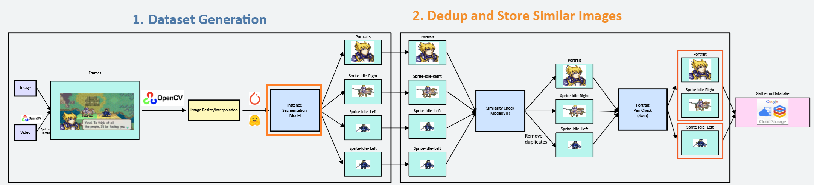
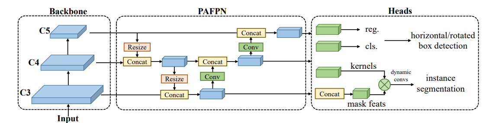
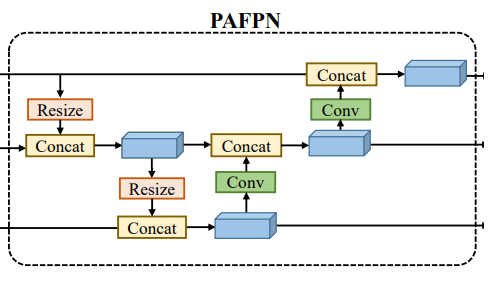
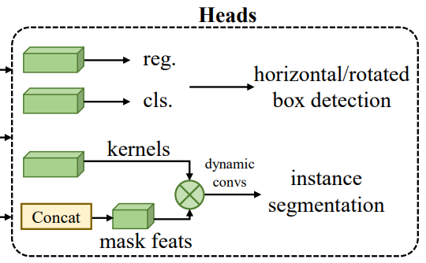

# Implementing Instance Segmentation Model From Basic Pytorch: Segformer

I'm currently working on a pixel sprite detection pipeline called [nino](https://github.com/flyxiv/nino):



For the segmentation model, I chose to implement `RTMDet-Ins`, because

1. I haven't used this model before, so it will be a good chance to learn about it
2. It is the current SOTA model for instance segmentation in real time.

## 0. Overview

- [paper link](https://arxiv.org/pdf/2212.07784)



1. Need custom CSP backbone blocks
2. PAFPN
3. Heads for various tasks

seems simple.

## 1. Implement Custom CSP

RTMDet uses **5x5 conv layer bottleneck blocks like the below image's figure 3.b:**


The CSP layer puts input through a 1x1 or 3x3 with 2 stride CNN layer depending on whether to downsampling or not.
All can be easily implemented by torch components.

```python
from torch import nn

class RTMDetBottleneck(nn.Module):
    """RTMDet Bottleneck Block Layer

    Uses 5x5 depthwise Convolution layer and a Pointwise 1x1 Convolution layer
    Preserves
    """
    def __init__(self, in_channels):
        super().__init__()

        self.in_channels = in_channels
        self.out_channels = in_channels

        self.conv1 = nn.Conv2d(self.in_channels, self.out_channels, kernel_size=3, stride=1, padding=1)

        self.batch_norm1 = nn.BatchNorm2d(self.out_channels)
        self.silu = nn.SiLU()

        # groups=self.out_channels for depthwise convolution
        self.conv2 = nn.Sequential(
            nn.Conv2d(self.out_channels, self.out_channels, kernel_size=5, stride=1, groups=self.out_channels, padding=2),
            nn.Conv2d(self.out_channels, self.out_channels, kernel_size=1, stride=1),
        )
        self.batch_norm2 = nn.BatchNorm2d(self.out_channels)

    def forward(self, x):
        x = self.conv1(x)
        x = self.batch_norm1(x)
        x = self.silu(x)

        x = self.conv2(x)
        x = self.batch_norm2(x)
        x = self.silu(x)
        return x

class RTMDetCSPBlock(nn.Module):
    """RTMDet CSP Block Layer

    Uses rtmdet bottleneck layer.

    Input:
        x: torch.Tensor, shape: (B, C, H, W)

    Output:
        x: torch.Tensor, shape: (B, C', H', W')
    """

    def __init__(self, in_channels, out_channels, downsample=False):
        super().__init__()

        self.in_channels = in_channels
        self.out_channels = out_channels

        if downsample:
            self.conv = nn.Conv2d(self.in_channels, self.in_channels, kernel_size=3, stride=2, padding=1)
        else:
            self.conv = nn.Conv2d(self.in_channels, self.in_channels, kernel_size=1, stride=1)

        self.bottleneck = RTMDetBottleneck(in_channels=in_channels)
        self.merge_conv = nn.Conv2d(self.in_channels * 2, self.out_channels, kernel_size=1, stride=1)

    def forward(self, x):
        x = self.conv(x)
        x_bottleneck = self.bottleneck(x)
        x_concat = torch.cat([x, x_bottleneck], dim=1)
        x_merged = self.merge_conv(x_concat)

        return x_merged
```

</br></br>

# 2. PAFPN



Paper doesn't explain in detail. **Resize is probably interpolation/downsampling into CSP Block.**
PAFPN upsampling isn't done using transpose CNN layers. Instead we use manual upsample function from Pytorch.

```python
"""Implementation of the RTMDet PAFPN Block
Explained in the paper: https://paperswithcode.com/paper/rtmdet-an-empirical-study-of-designing-real
"""

import torch.nn as nn

class PAFPN(nn.Module):
    """PAFPN Block
    A feature pyramid model first introduced in https://paperswithcode.com/method/pafpn

    in_channels: Channel of C3, the layer with least channel. C4, C5 have *2, *4 channels respectively.
    """

    def __init__(self, in_channels, out_channels):
        super().__init__()
        self.c5_reduce = nn.Conv2d(in_channels=in_channels * 4, out_channels=out_channels, kernel_size=1, stride=1, padding=0)
        self.c4_reduce = nn.Conv2d(in_channels=in_channels * 2, out_channels=out_channels, kernel_size=1, stride=1, padding=0)
        self.c3_reduce = nn.Conv2d(in_channels=in_channels, out_channels=out_channels, kernel_size=1, stride=1, padding=0)

        self.c4_csp_up = RTMDetCSPBlock(in_channels=out_channels * 2, out_channels=out_channels, downsample=False)
        self.c3_csp_up = RTMDetCSPBlock(in_channels=out_channels * 2, out_channels=out_channels, downsample=False)

        self.c3_csp_down = RTMDetCSPBlock(in_channels=out_channels, out_channels=out_channels, downsample=True)
        self.c4_csp_down = RTMDetCSPBlock(in_channels=out_channels * 2, out_channels=out_channels, downsample=True)

        self.c3_out = RTMDetCSPBlock(in_channels=out_channels, out_channels=out_channels, downsample=False)
        self.c4_out = RTMDetCSPBlock(in_channels=out_channels * 2, out_channels=out_channels, downsample=False)
        self.c5_out = RTMDetCSPBlock(in_channels=out_channels * 2, out_channels=out_channels, downsample=False)


    def forward(self, c3, c4, c5):
        """Receives 3 feature maps from the CSPBackbone

        Input: 3 feature maps
            c3, c4, c5 all in image format (B, C, H, W)

        Output: 3 feature maps
            c3_concat, c4_concat, c5_concat all in image format (B, C, H, W)
        """
        p5 = self.c5_reduce(c5)
        p4 = self.c4_reduce(c4)
        p3 = self.c3_reduce(c3)

        # 1. Downward concatenation
        p5_up = F.interpolate(p5, size=p4.shape[2:], mode='bilinear')
        p4_plus = torch.cat([p5_up, p4], dim=1)
        p4_up = self.c4_csp_up(p4_plus)

        p4_up_up = F.interpolate(p4_up, size=p3.shape[2:], mode='bilinear')
        p3_plus = torch.cat([p4_up_up, p3], dim=1)
        p3_out_temp = self.c3_csp_up(p3_plus)

        # 2. Upward concatenation
        p3_down = self.c3_csp_down(p3_out_temp)
        p4_plus_2 = torch.cat([p3_down, p4_up], dim=1)
        p4_out_temp = self.c4_csp_down(p4_plus_2)

        p5_plus = torch.cat([p4_out_temp, p5], dim=1)

        p3_out = self.c3_out(p3_out_temp)
        p4_out = self.c4_out(p4_plus_2)
        p5_out = self.c5_out(p5_plus)

        return p3_out, p4_out, p5_out

```

</br></br>

# 3. Detection Head



Detection head doesn't have a clear explanation also, so we'll have to make some assumptions.

1. **labels are calculated separately for P3, P4, P5**

   - P3 is usually 8 stride(grid 8x8), P4 is 16, and P5 is 32
   - Making predictions on all three pyramids make **model more flexible to object size, being able to detect objects that are better detected on different grid sizes**

2. **Translating (88, 72, 9) kernel shape to kernel**

- Kernel mask has a total of 10 channels
- 1x1 Conv Layer with bias, for 8 output layers makes `(1 * 10 + 1) * 8 = 88`.
- 3x3 Conv Layer without bias, for 1 output layer makes `(9 * 8) * 1 = 72`
- 3x3 Conv Layer without bias, for 1 output layer makes `(9) * 1 = 9`

To sum it up, the instance mask will have the following structure:


The mask calculation will be done as a postprocess after the detection head, since it is done only for valid prediction objects after the confidence threshold and nms algorithms.
so **the role of the head will be to create the building blocks for generating the actual prediction:**

1. The classification output: which will output the probability of having a bounding box of each class at each grid
2. The bounding box regression output: which will output the expected bounding box in the form of (offset_of_bbox_center_x_from_grid, offset_of_bbox_center_y_from_grid, width, height)
3. Mask kernel(169 channel convolution output) and Mask feature(8 features + 2 coordinate channels = 10 channels)

```python
"""Implements RTMDet Head for object detection and instance segmentation
Based on Paper: https://arxiv.org/pdf/2212.07784v2
"""

import torch
import torch.nn as nn
import torch.nn.functional as F

class RTMDetHead(nn.Module):
    """RTMDet Head for object detection and instance segmentation

    Contains:
    1. Classification Head
    2. Regression Head
    3. Mask Head (for instance segmentation)
    """

    MASK_FEATURES = 8
    MASK_KERNEL_FEATURES = 169

    def __init__(self,
                 in_channels,
                 feat_channels=256,
                 num_classes=80,
                 stacked_convs=2,
                 ):
        super().__init__()

        self.in_channels = in_channels
        self.feat_channels = feat_channels
        self.num_classes = num_classes
        self.stacked_convs = stacked_convs

        # Classification Head
        cls_convs = []
        for i in range(self.stacked_convs):
            chn = self.in_channels if i == 0 else self.feat_channels
            cls_convs.append(
                nn.Conv2d(chn, self.feat_channels, kernel_size=3, padding=1))
            cls_convs.append(nn.BatchNorm2d(self.feat_channels))
            cls_convs.append(nn.SiLU(inplace=True))
        self.cls_convs = nn.Sequential(*cls_convs)
        self.cls_out = nn.Conv2d(self.feat_channels, self.num_classes, kernel_size=1)

        # Regression Head
        reg_convs = []
        for i in range(self.stacked_convs):
            chn = self.in_channels if i == 0 else self.feat_channels
            reg_convs.append(
                nn.Conv2d(chn, self.feat_channels, kernel_size=3, padding=1))
            reg_convs.append(nn.BatchNorm2d(self.feat_channels))
            reg_convs.append(nn.SiLU(inplace=True))
        self.reg_convs = nn.Sequential(*reg_convs)
        self.reg_out = nn.Conv2d(self.feat_channels, 4, kernel_size=1)


        # Mask Head
        self.mask_kernel_convs = nn.Sequential(
            nn.Conv2d(self.in_channels, self.feat_channels, kernel_size=3, padding=1),
            nn.BatchNorm2d(self.feat_channels),
            nn.SiLU(inplace=True),
            nn.Conv2d(self.feat_channels, self.feat_channels, kernel_size=3, padding=1),
            nn.BatchNorm2d(self.feat_channels),
            nn.SiLU(inplace=True),
            nn.Conv2d(self.feat_channels, self.MASK_KERNEL_FEATURES, kernel_size=1)
        )

        self.mask_feat_convs = nn.Sequential(
            nn.Conv2d(self.in_channels, self.feat_channels, kernel_size=3, padding=1),
            nn.BatchNorm2d(self.feat_channels),
            nn.SiLU(inplace=True),
            nn.Conv2d(self.feat_channels, self.feat_channels, kernel_size=3, padding=1),
            nn.BatchNorm2d(self.feat_channels),
            nn.SiLU(inplace=True),
            nn.Conv2d(self.feat_channels, self.feat_channels, kernel_size=3, padding=1),
            nn.BatchNorm2d(self.feat_channels),
            nn.SiLU(inplace=True),
            nn.Conv2d(self.feat_channels, self.feat_channels, kernel_size=3, padding=1),
            nn.BatchNorm2d(self.feat_channels),
            nn.SiLU(inplace=True),
            nn.Conv2d(self.feat_channels, self.MASK_FEATURES, kernel_size=1)
        )

    def _forward_single_level(self, x):
        cls_feat = self.cls_convs(x)
        cls_score = self.cls_out(cls_feat)

        reg_feat = self.reg_convs(x)
        bbox_pred = self.reg_out(reg_feat)

        mask_kernels = self.mask_kernel_convs(x)
        mask_feats = self.mask_feat_convs(x)
        mask_feats = torch.concat([mask_feats, self.create_coord_features(x.size(0), x.size(2), x.size(3))], dim=1)

        assert mask_feats.size(1) == self.MASK_FEATURES + 2
        assert mask_kernels.size(1) == self.MASK_KERNEL_FEATURES

        return cls_score, bbox_pred, mask_kernels, mask_feats

    @staticmethod
    def create_coord_features(n_batch, w, h):
        x_range = torch.linspace(-1, 1, w)
        y_range = torch.linspace(-1, 1, h)
        y, x = torch.meshgrid(y_range, x_range, indexing='ij')
        coord_features_batch = torch.stack([x, y], dim=0).unsqueeze(0).expand(n_batch, -1, -1, -1)

        return coord_features_batch

    def forward(self, feats):
        """Gets input from P3, P4, P5 and gives outputs needed for creating predictions.

        Args:
            feats: P3, P4, P5 output from PAFPN

        Returns:
            cls_scores: has n_classes predictions for every P3/P4/P5 pixels

            bbox_preds: has n_classes * 4 predictions for every P3/P4/P5 pixels, one bbox
                        prediction is of format (center_dx_from_grid, center_dy_from_grid, w, h)

            mask_kernels: (B, MASK_KERNEL_FEATURES, H, W)
            mask_feats: (B, MASK_FEATURES + 2, H, W)
        """
        cls_scores = []
        bbox_preds = []
        mask_kernels_list = []
        mask_feats_list = []

        for feat in feats:
            cls_score, bbox_pred, mask_kernels, mask_feats = self._forward_single_level(feat)
            mask_kernels_list.append(mask_kernels)
            mask_feats_list.append(mask_feats)

            cls_scores.append(cls_score)
            bbox_preds.append(bbox_pred)

        return cls_scores, bbox_preds, mask_kernels_list, mask_feats_list
```

# Conclusion

This implements all the backbone/neck/head building blocks of the model. There is still more to be done:

1. Preprocess: Loading COCO format dataset as label, data augmentation
2. Translation: Translate label coordinates to grid/offset in P3/P4/P5 coordinates.
3. PostProcess: nms + confidence threshold to remove incompetent predictions, mapping predictions to ground truth, mask dynamic CNN logic
4. Debugging: Showing image with masks overlapped.

All these will be handled in separate pages.
