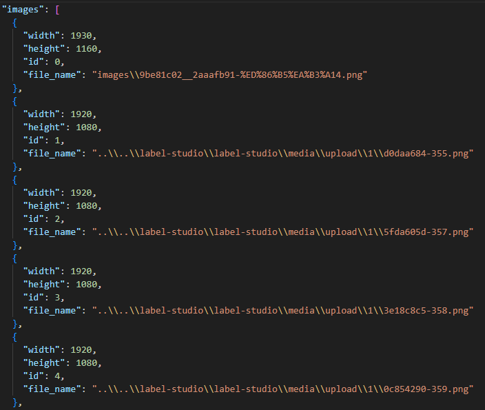
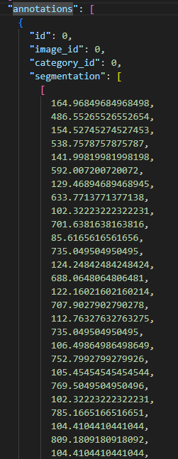
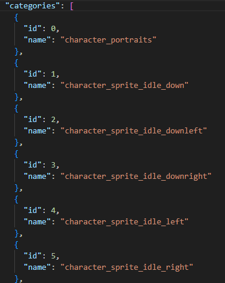

The most widely used image dataset format is COCO.

COCO format: https://cocodataset.org/#home

1. label metadata is handled in train/valid/test.json
2. image metadata in `images`, annotation data in `annotations`, labels in `

# 1. Basic COCO Format Example

1. images: Contains image id and path where image is stored



2. annotations: Contains image id and category id that the annotation belongs in.
   - Can have multiple annotations(=instances) for each image
   - labels include: category(label_id for classification) bbox([x_box_leftupper_corner, y_box_leftupper_corner, w, h], for object detection) and segmentation([x1 y1 x2 y2 ... format])



3. categories: category id and the label's name



# 2. Needed Steps for Preprocessing

1. Split annotation files into train/valid/test

   - Image directory doesn't need to be splitted, only the annotations

2. Read images and annotation from each split and organize them into Dataloaders

   - Trying to keep it simple as possible, so we won't be adding augmentations yet.

3. Convert segment annotation to model label
   - Segment annotation comes in a list of lines that makes up a polygon, but the model gives segment output as **a 2d mask of the bounding box.**

# 3. Implementation

## 1: Split annotation files into train/valid/test

```python
import cv2
import argparse
import sklearn
import json

from pathlib import Path
from sklearn.model_selection import train_test_split

TRAIN_RATIO = 0.7
VALID_RATIO = 0.15
TEST_RATIO = 0.15

def split_coco_dataset(input_dir: Path, output_dir: Path):
coco_data = json.load(open(input_dir / "result.json"))

    output_dir.mkdir(parents=True, exist_ok=True)
    (output_dir / "images").mkdir(exist_ok=True)

    all_images = coco_data["images"]
    image_ids = [img["id"] for img in all_images]

    train_ids, valid_test_ids = train_test_split(image_ids, train_size=TRAIN_RATIO, random_state=42)

    valid_ratio_adjusted = VALID_RATIO / (VALID_RATIO + TEST_RATIO)
    valid_ids, test_ids = train_test_split(valid_test_ids, train_size=valid_ratio_adjusted, random_state=42)

    train_ids_set = set(train_ids)
    valid_ids_set = set(valid_ids)
    test_ids_set = set(test_ids)

    train_images = []
    valid_images = []
    test_images = []

    for img in all_images:
        if img["id"] in train_ids_set:
            train_images.append(img)
        elif img["id"] in valid_ids_set:
            valid_images.append(img)
        elif img["id"] in test_ids_set:
            test_images.append(img)

    all_annotations = coco_data["annotations"]

    train_annotations = []
    valid_annotations = []
    test_annotations = []

    for ann in all_annotations:
        if ann["image_id"] in train_ids_set:
            train_annotations.append(ann)
        elif ann["image_id"] in valid_ids_set:
            valid_annotations.append(ann)
        elif ann["image_id"] in test_ids_set:
            test_annotations.append(ann)

    train_coco = {
        "images": train_images,
        "annotations": train_annotations,
        "categories": coco_data["categories"]
    }

    valid_coco = {
        "images": valid_images,
        "annotations": valid_annotations,
        "categories": coco_data["categories"]
    }

    test_coco = {
        "images": test_images,
        "annotations": test_annotations,
        "categories": coco_data["categories"]
    }

    with open(output_dir / "train.json", "w") as f:
        json.dump(train_coco, f, indent=4)

    with open(output_dir / "valid.json", "w") as f:
        json.dump(valid_coco, f, indent=4)

    with open(output_dir / "test.json", "w") as f:
        json.dump(test_coco, f, indent=4)

    print(f"Split complete!")
    print(f"Train set: {len(train_images)} images, {len(train_annotations)} annotations")
    print(f"Valid set: {len(valid_images)} images, {len(valid_annotations)} annotations")
    print(f"Test set: {len(test_images)} images, {len(test_annotations)} annotations")
    print(f"Output saved to {output_dir}")


if __name__ == "__main__":
	parser = argparse.ArgumentParser()

    parser.add_argument("--input-dir", type=str, required=True)
    parser.add_argument("--output-dir", type=str, required=True)

    args = parser.parse_args()

    input_dir = Path(args.input_dir)
    output_dir = Path(args.output_dir)

    split_coco_dataset(input_dir, output_dir)

```

## 2 and 3: Convert COCO segment label to bbox mask label and

Converting segmentation requires a lot of math, so we instead use **pycocotools library** to do the conversion job.

```python
import os
import json
import numpy as np
from PIL import Image
import torch
from torch.utils.data import Dataset, DataLoader
import torchvision.transforms as transforms
from pycocotools.coco import COCO
from pycocotools import mask as coco_mask
import cv2
from tqdm import tqdm

TRAIN_ANNOTATION_FILE = "train.json"
VALID_ANNOTATION_FILE = "valid.json"
TEST_ANNOTATION_FILE = "test.json"

class COCOSegmentationDataset(Dataset):
    def __init__(self, root_dir, ann_file, transform=None, img_size=(512, 512)):
        """
        COCO Segmentation 데이터셋을 로드하는 클래스

        Args:
            root_dir (str): 이미지가 저장된 디렉토리 경로
            ann_file (str): COCO 형식의 어노테이션 파일 경로
            transform (callable, optional): 이미지에 적용할 변환
            img_size (int): 이미지와 마스크를 리사이즈할 크기 (img_size, img_size)
        """
        self.root_dir = root_dir
        self.coco = COCO(ann_file)
        self.ids = list(sorted(self.coco.imgs.keys()))
        self.transform = transform
        self.img_size = img_size

    def __len__(self):
        return len(self.ids)

    def __getitem__(self, idx):
        img_id = self.ids[idx]

        img_info = self.coco.loadImgs(img_id)[0]
        img_path = os.path.join(self.root_dir, img_info['file_name'])

        img = Image.open(img_path).convert('RGB')
        orig_width, orig_height = img.size
        img = img.resize(self.img_size, Image.BILINEAR)

        ann_ids = self.coco.getAnnIds(imgIds=img_id)
        anns = self.coco.loadAnns(ann_ids)

        masks = []
        boxes = []
        labels = []

        for ann in anns:
            cat_id = ann['category_id']
            labels.append(cat_id)

            if type(ann['segmentation']) == list:
                rles = coco_mask.frPyObjects(ann['segmentation'], orig_height, orig_width)
                mask = coco_mask.decode(rles)
                if len(mask.shape) > 2:
                    mask = mask.sum(axis=2) > 0
            else:
                mask = coco_mask.decode(ann['segmentation'])

            mask = cv2.resize(mask.astype(np.uint8), self.img_size, interpolation=cv2.INTER_NEAREST)
            masks.append(mask)

            bbox = ann['bbox']

            x1 = bbox[0] * self.img_size[0] / orig_width
            y1 = bbox[1] * self.img_size[1] / orig_height
            x2 = (bbox[0] + bbox[2]) * self.img_size[0] / orig_width
            y2 = (bbox[1] + bbox[3]) * self.img_size[1] / orig_height

            boxes.append([x1, y1, x2, y2])

        if self.transform:
            img = self.transform(img)
        else:
            img = transforms.ToTensor()(img)

        if masks:
            masks = torch.as_tensor(np.stack(masks), dtype=torch.uint8)
        else:
            masks = torch.zeros((0, self.img_size[1], self.img_size[0]), dtype=torch.uint8)

        if boxes:
            boxes = torch.as_tensor(boxes, dtype=torch.float32)
        else:
            boxes = torch.zeros((0, 4), dtype=torch.float32)

        labels = torch.as_tensor(labels, dtype=torch.int64) if labels else torch.zeros(0, dtype=torch.int64)

        target = {
            'boxes': boxes,
            'labels': labels,
            'masks': masks,
            'image_id': torch.tensor([img_id]),
            'orig_size': torch.as_tensor([orig_height, orig_width], dtype=torch.int64)
        }

        return img, target

def collate_fn(batch):
    images = []
    targets = []
    for img, tgt in batch:
        images.append(img)
        targets.append(tgt)

    images = torch.stack(images, dim=0)

    return images, targets

def get_coco_dataloaders(root_dir, batch_size=4, num_workers=1, shuffle=True, img_size=512):
    """Create train/valid/test dataloaders for COCO format segmentation dataset.
    """

    # TODO: Add normalization
    transform = transforms.Compose([
        transforms.ToTensor(),
    ])

    train_dataset = COCOSegmentationDataset(
        root_dir=root_dir,
        ann_file=TRAIN_ANNOTATION_FILE,
        transform=transform,
        img_size=img_size
    )

    train_dataloader = DataLoader(
        train_dataset,
        batch_size=batch_size,
        shuffle=shuffle,
        num_workers=num_workers,
        collate_fn=collate_fn
    )

    valid_dataset = COCOSegmentationDataset(
        root_dir=root_dir,
        ann_file=VALID_ANNOTATION_FILE,
        transform=transform,
        img_size=img_size
    )

    valid_dataloader = DataLoader(
        valid_dataset,
        batch_size=batch_size,
        shuffle=shuffle,
        num_workers=num_workers,
        collate_fn=collate_fn
    )

    test_dataset = COCOSegmentationDataset(
        root_dir=root_dir,
        ann_file=TEST_ANNOTATION_FILE,
        transform=transform,
        img_size=img_size
    )

    test_dataloader = DataLoader(
        test_dataset,
        batch_size=batch_size,
        shuffle=shuffle,
        num_workers=num_workers,
        collate_fn=collate_fn
    )

    return train_dataloader, valid_dataloader, test_dataloader

```
