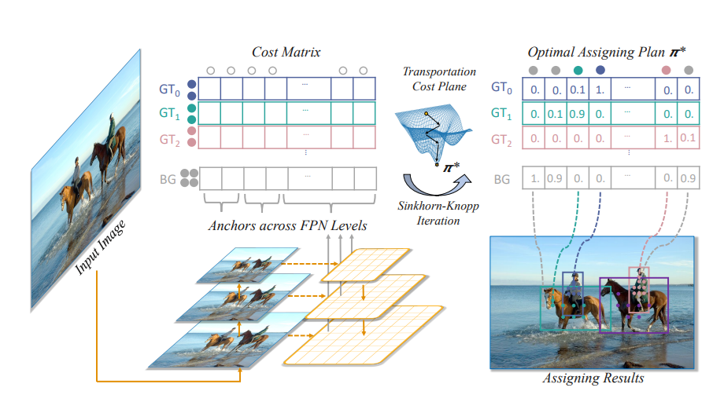
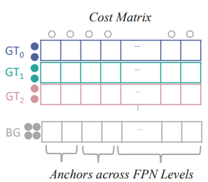
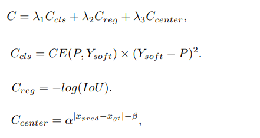

Detection models make a lot of anchors, way more than actual ground truth labels.
It is the model's job to map the best matching anchors to the ground truth.

RTMDet-Ins uses [SimOTA](https://openaccess.thecvf.com/content/CVPR2021/papers/Ge_OTA_Optimal_Transport_Assignment_for_Object_Detection_CVPR_2021_paper.pdf) algorithm to do this task.



# 1. Cost Matrix

First we calculate the cost matrix that shows how similar each anchor box is to each ground truth label



The paper says cost matrix of each (prediction, ground truth) is calculated as follows:



## 1-1. IoU Calculation

```python
def calculate_iou(bbox_pred, bbox_label):
    """
    Calculate IoU(Intersection over Union) between two bounding boxes.

    bbox value: [x, y, w, h], all values are normalized to [0, 1] + x, y are upper left corner

    Returns:
        float: IoU value (0~1)
    """
    x1, y1, w1, h1 = bbox_pred
    x2, y2, w2, h2 = bbox_label

    area1 = w1 * h1
    area2 = w2 * h2

    x1_right = x1 + w1
    y1_bottom = y1 + h1
    x2_right = x2 + w2
    y2_bottom = y2 + h2

    intersection_x_left = max(x1, x2)
    intersection_y_top = max(y1, y2)
    intersection_x_right = min(x1_right, x2_right)
    intersection_y_bottom = min(y1_bottom, y2_bottom)

    intersection_width = max(0, intersection_x_right - intersection_x_left)
    intersection_height = max(0, intersection_y_bottom - intersection_y_top)

    intersection_area = intersection_width * intersection_height

    union_area = area1 + area2 - intersection_area

    iou = intersection_area / union_area if union_area > 0 else 0

    return iou
```

# 1-2. Calculate Cost for Each (Pred, Ground Truth) pair

```python
EPSILON  = 1e-10

class LabelPostProcessor:
    def _calculate_cost_matrix_one_sample(self, cls_scores, bbox_preds, gt_labels, gt_bboxes):
        """Calculate cost matrix for one sample
        cost: lambda1 * classification loss + lambda2 * iou loss + lambda3 * center loss

        classification loss: Uses soft label y_soft(using IoU between gt and pred bboxes) and prediction value y_pred
            * y_soft = IoU(pred_bbox, gt_bbox)
            * y_pred = cls_scores
            * loss = Cross Entropy(y_soft, y_pred) * (y_soft - y_pred) ** 2

        iou loss: Uses IoU between gt and pred bboxes
            * loss = -log(IoU(pred_bbox, gt_bbox))

        center loss: Uses center distance between gt and pred bboxes
            * loss = alpha**(abs(x_pred - x_gt) - beta)

        Args: B = batch size, P = number of predictions, G = number of ground truth, C = number of classes
            cls_scores: (P, C)
            bbox_preds: (P, 4)
            gt_labels: (G)
            gt_bboxes: (G, 4)

        Returns:
            cost_matrix: (G, P)
            gt_pred_iou_matrix: (G, P)
        """
        num_preds = cls_scores.shape[0]
        max_num_gts = gt_labels.shape[0]

        cost_matrix = torch.zeros(max_num_gts, num_preds, device=cls_scores.device)
        iou_matrix = torch.zeros(max_num_gts, num_preds, device=cls_scores.device)

        for (gt_idx, gt_bbox) in enumerate(gt_bboxes):
            class_idx = gt_labels[gt_idx]

            for (pred_idx, pred_bbox) in enumerate(bbox_preds):
                iou = calculate_iou(pred_bbox, gt_bbox)
                y_pred = cls_scores[pred_idx, class_idx]
                y_soft = iou
                iou_matrix[gt_idx, pred_idx] = iou

                cost_matrix[gt_idx, pred_idx] = lambda1 * ((BCEWithLogitsLoss(y_pred, y_soft) * (y_soft - y_pred) ** 2).item())
                cost_matrix[gt_idx, pred_idx] += -lambda2 * torch.log(iou + EPSILON)

                x_pred = pred_bbox[:2]
                x_gt = gt_bbox[:2]

                cost_matrix[gt_idx, pred_idx] += lambda3 * alpha ** (torch.abs(x_pred - x_gt) - beta)

        return cost_matrix, iou_matrix
```

- To ease the limitation and compute time, RTMDet uses a **simplified version of Sinkhorn-Knopp Algorithm, which doesn't need positive assumption**

# 1-3. Dynamic-k Mapping

- Each ground truth receives different number(k) of labels.
- This dynamic number is decided by a hyperparameter(q).
  - For each ground truth label, we sum up the highest q IoU values and floor value to estimate the k value.

```python
    def _dynamic_k_matching(self, cost_matrix, iou_matrix, valid_masks=None):
        """Dynamically decides the appropriate number k for each ground truth and collects top k predictions.

        Algorithm is described in
        paper: https://openaccess.thecvf.com/content/CVPR2021/papers/Ge_OTA_Optimal_Transport_Assignment_for_Object_Detection_CVPR_2021_paper.pdf

        But RTGDet uses a simplified version to make the calculation faster in exchange for accuracy.

        args: G is the number of ground truth, P is the number of predictions
            cost_matrix: (G, P)
            iou_matrix: (G, P)
            valid_masks: (G), bboxes that aren't too small

        Returns:
            matching_matrix: (G, P)
        """

        matching_matrix = torch.zeros_like(cost_matrix)

        n_candidate_k = min(self.q, cost_matrix.shape[1])

        # find top k predictions with highest iou for each ground truth
        # topk_ious: (G, n_candidate_k)
        topk_ious, _ = torch.topk(iou_matrix, n_candidate_k, dim=1)

        # get dynamic_k = the floor of the sum of ious for each ground truth: (G)
        dynamic_ks = torch.clamp(topk_ious.sum(1).int(), min=1)

        # find top k predictions with highest cost for each ground truth
        for gt_idx in range(cost_matrix.shape[0]):
            _, pred_idx = torch.topk(cost_matrix[gt_idx], k=dynamic_ks[gt_idx], largest=False)
            matching_matrix[gt_idx][pred_idx] = 1

        if valid_masks is not None:
            matching_matrix = matching_matrix[:, valid_masks]


        anchor_matching_gt = matching_matrix.sum(0)

        # assign bboxes that are assigned to multiple ground truths to the one with highest iou
        if (anchor_matching_gt > 1).sum() > 0:
            multiple_match_mask = anchor_matching_gt > 1
            _, cost_max = torch.max(similarity_matrix[:, multiple_match_mask], dim=0)

            matching_matrix[:, multiple_match_mask] = 0
            matching_matrix[cost_max, multiple_match_mask] = 1

        return matching_matrix
```

# 1-4. Combine the Cost/IoU Calculation and Dynamic-k to Batch Operation

```python
    def calculate_cost_matrix(self, cls_scores, bbox_preds, gt_labels, gt_bboxes):
        """Calculate cost matrix for SimOTA Algorithm

        Algorithm details are described in the paper:
           https://openaccess.thecvf.com/content/CVPR2021/papers/Ge_OTA_Optimal_Transport_Assignment_for_Object_Detection_CVPR_2021_paper.pdf

        Args: B = batch size, P = number of predictions, G = number of ground truth, C = number of classes
            cls_scores: (B, P, C)
            bbox_preds: (B, P, 4) - box predictions are in [x, y, w, h] format (x, y is bbox center)
            gt_labels: (B, G)
            gt_bboxes: (B, G, 4) - box ground truth are in [x, y, w, h] format (x, y is bbox center)

        Returns:
            matching_matrices: (B, P, G)
        """

        matching_matrices = []
        for (cls_score, bbox_pred, gt_label, gt_bbox) in zip(cls_scores, bbox_preds, gt_labels, gt_bboxes):
            cost_matrix, iou_matrix = self._calculate_cost_matrix_one_sample(cls_score, bbox_pred, gt_label, gt_bbox)
            matching_matrices.append(self._dynamic_k_matching(cost_matrix, iou_matrix))

        return torch.stack(matching_matrices, dim=0)
```
