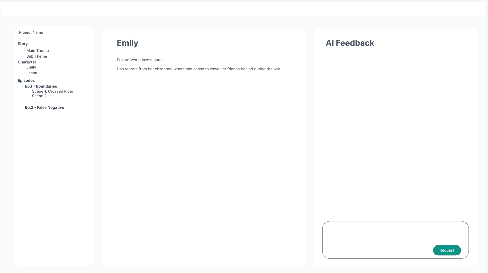
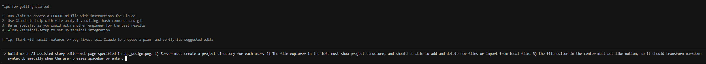
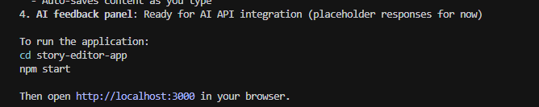
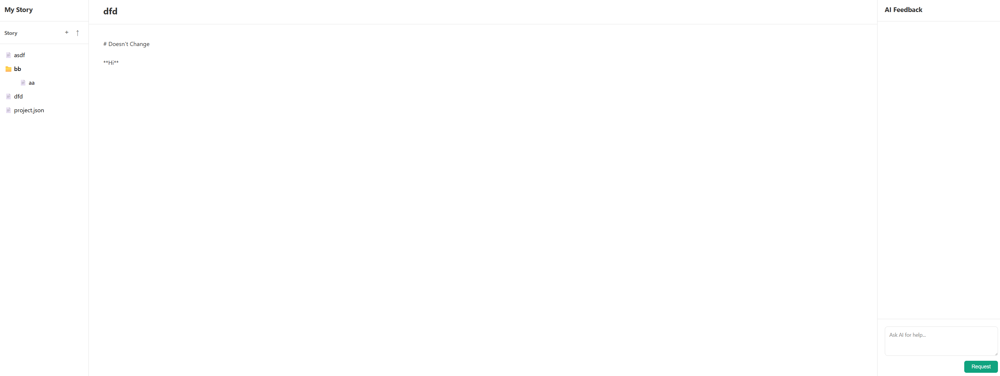
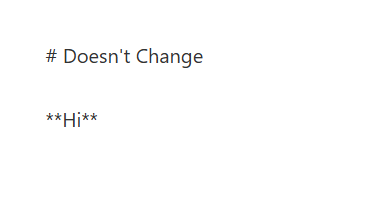
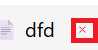
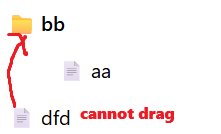
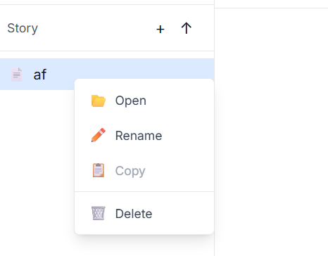

Claude Code is currently the best coding agent, so I wanted to give it a try and see its capabilities.

I had ideas of creating an AI-assisted story editor app, so I created the design for the application and threw it to Claude Code and saw if it can implement it.

# Design

I did a quick sketch on Figma, and the app design looks like this:



# Installing Claude Code

Very simple install

```sh
npm install -g @anthropic-ai/claude-code
```

# Prompting App Creation

## First Prompt



It asked for a few permissions, and then finished the app



The output was better than I expected for a first draft.



However I was able to find some problems which needed to be fixed

### 1. No Dynamic Markdown Translation

It didn't translate text into markdown like I wanted it to.



I asked Claude Code to fix it:

```
Nice job! There are few things I want to add.\
  \
  First of all the editor doesn't translate markdown text. When I type # Hi and press enter or spacebar, I want it to change to a header.
```

Claude Code fixed it immediately.


### 2. Delete Icon Is Too Close to File




- The Delete icon spawns right next to the file, so the user might misclick the delete icon when they wanted to click the file.
- Also, we can't move file/directories in the explorer.

To solve this I want to create a Mouse interaction system for the app:

1. We can drag and drop files into directories in the file explorer
2. When we right click the file, common options like "open", "rename", "delete" pops up

- Prompt:

```
Thank you! Now I want to change the delete icon in the file explorer, since users might misclick the button because it is too close to the file icon. \                                                                                                                                                                                                                  │
│   1) Instead can we add a right click option for the file explorer so that when we right click on a file or directory common options like "open", "rename", "copy" and "delete" can be selected? Also it would be nice if "Create file" option is available for only directories.\                                                                                         │
│   \                                                                                                                                                                                                                                                                                                                                                                        │
│   2) Also can we implement a drag option for the file explorer? \                                                                                                                                                                                                                                                                                                          │
│   \\                                                                                                                                                                                                                                                                                                                                                                       │
│      * The file explorer opens file or directory when we "double click" the file. Single click "selects" the file/directory, highlighting it. Pressing shift and clicking other files selects sequential files from the first file/directory to the next clicked file/directory, and control + click selects all files/directories that are clicked.                       │
│      * I want to drag these selected files/directories to directories to move the files into the directory.
```

After a few fixes, Claude Code implemented what I requested:



## Second Prompt: Add Login Screen

```
The story-editor-nextjs project works well. Now I need a login page and create project option to distinguish each user's project directory in the server.
```

Surprisingly it made a good login screen:


However, nobody wants to create a brand new account these days. We want to login using our Google/Instagram accounts, so I want to change this to OAuth2 login.

```
Nice work! However users don't like creating new accounts for websites: they want to login using their SNS accounts: google, instagram, etc. Can you make our login do so too?
```
