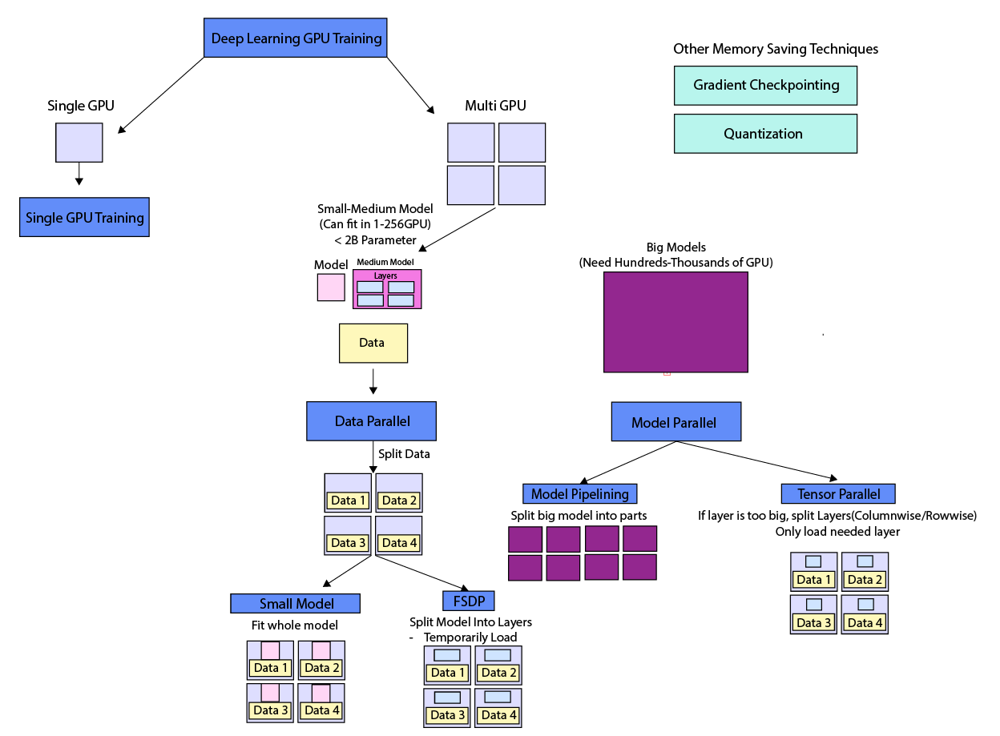

Training in a single GPU environment is enough for small models, but when we start to handle big LLM models, we need to utilize tens, hundreds, and even thousands of GPUs to train models.

There are a lot of techniques for utilizing multiple GPU depending on model size, data size, and the number of GPUs, like the diagram below:



# Data Parallel Methods

Data parallel methods are relatively easier to implement than model parallel, and they split the data by the number of gpus and give each gpu a partition of the whole data.

## 1. DDP (Distributed Data Parallel)

The simplest Data Parallel method can be implemented using pytorch's DDP.

- **Every GPU gets a full copy of the model(memory overhead)**

Example function can be found here: [pytorch example](https://docs.pytorch.org/docs/stable/notes/ddp.html)

```python
import torch
import torch.distributed as dist
import torch.multiprocessing as mp
import torch.nn as nn
import torch.optim as optim
import os
from torch.nn.parallel import DistributedDataParallel as DDP


def example(rank, world_size):
    # create default process group
    dist.init_process_group("gloo", rank=rank, world_size=world_size)
    # create local model
    model = nn.Linear(10, 10).to(rank)
    # construct DDP model
    ddp_model = DDP(model, device_ids=[rank])
    # define loss function and optimizer
    loss_fn = nn.MSELoss()
    optimizer = optim.SGD(ddp_model.parameters(), lr=0.001)

    # forward pass
    outputs = ddp_model(torch.randn(20, 10).to(rank))
    labels = torch.randn(20, 10).to(rank)
    # backward pass
    loss_fn(outputs, labels).backward()
    # update parameters
    optimizer.step()

def main():
    world_size = 2
    mp.spawn(example,
        args=(world_size,),
        nprocs=world_size,
        join=True)

if __name__=="__main__":
    # Environment variables which need to be
    # set when using c10d's default "env"
    # initialization mode.
    os.environ["MASTER_ADDR"] = "localhost"
    os.environ["MASTER_PORT"] = "29500"
    main()
```
