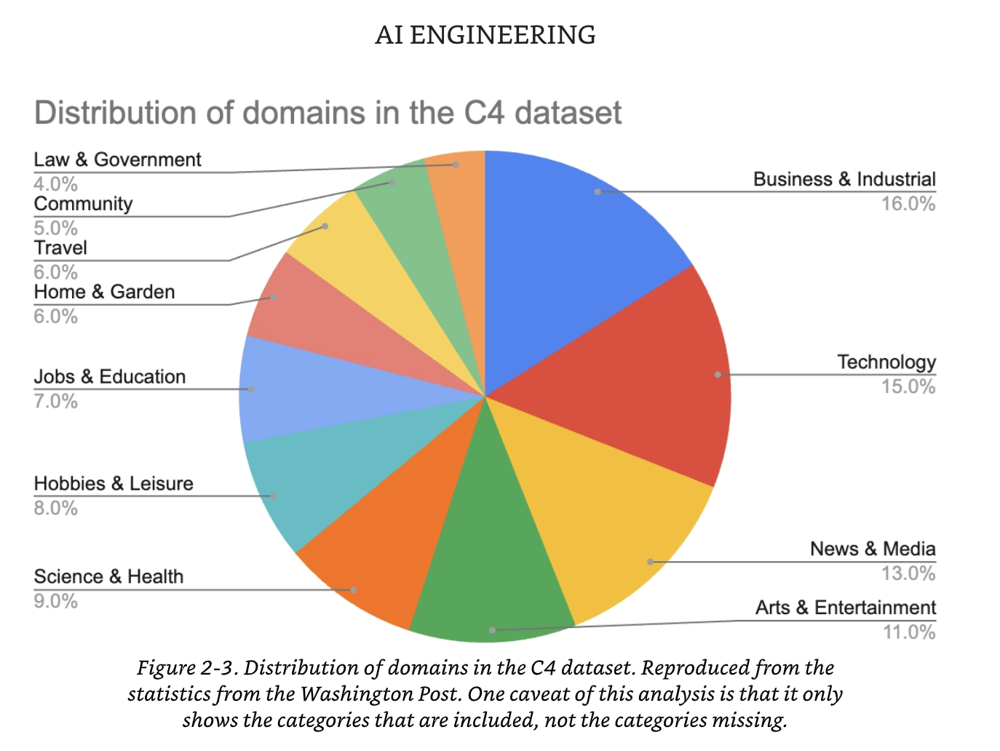
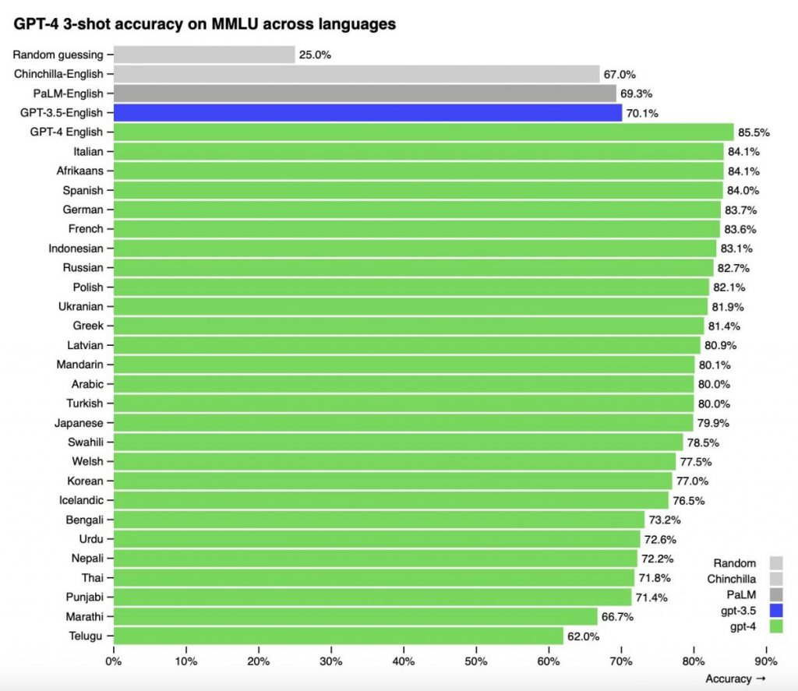

I'm summarizing helpful informations from the book `AI Engineering` by Chip Huyen on Foundation Models(Chater 2)

# 1. Training Data

## Common Crawl

Widely used open source text corpus.

- The whole set isn't clean, but due to its availability a lot of models use a subset(cleaned) like C4(Colossal Clean Crawled Corpus) version of this dataset.
- More and more models are not disclosing their training data due to competition.



## Multilanguage - English is the Best



1. English takes up 49% of the Common Crawl dataset. No wonder the model performs best on benchmarks with English prompts.
2. This is due not only to underrepresentation, but also due to language's structure and embodying culture.
3. Some languages require ten times longer tokens to represent the same thing, causing more latency and cost.

## Domain-Specific Datasets

- DeepMind Alphafold (protein sequence/3D structure), NVIDIA BioNeMo, Google Med-PaLM2

# 2. Modeling

Of course, the best LLM architecture is `Transformer`

However, transformer also has its own limitations.

## Transformer History

- Seq2Seq(RNN encoder-decoder) was doing good on machine translation - Google Translation: `best improvements to date for machine translation`

  - Problem 1: Only uses final hidden state (similar to using only book summary to answer questions about book) - limited quality
  - Problem 2: Input processing(encoding) and output generation(decoder) are done sequentially -> slow.

- Transformer uses
  - attention mechanism to address Problem 1
  - input tokens can be processed in parallel(but not the output generation part for auto-regressive models), partially addressing Problem 2.

Context length is a continuing problem in transformers, so new architectures such as RWKV, SSMs(Mamba, Jamba) are being developed.

- Still hard to overthrow transformer, since it's been heavily optimized since 2017.

# 3. Model Size

- 1B is almost 1GB, so 7B w/ fp16(2Byte) = at least 14GB of GPU memory.
- However there are sparse models(many 0 parameters)
- MoE models also share parameters, so little less parameters (ex) Mistral 8x7B - 8 \* 7B = 56B parameters, but actually 46.7B because of shared parameters)

## Dataset Size

This can be tricky: the number of texts isn't good - one whole book is way better than one sentence.

- Number of tokens(trainig tokens) is better metric, although it has its limitations(different token number for same dataset for different LLMs)
- Still, as of today, LLMs are trained on `trillions` of tokens

## Compute Resource

- Measured in FLOPs(not FLOP/s)
- GPU 50% utilization is ok, 70% higher is great.

```
ex) GPT-3-175B was trained using 3.14 * 10^23 FLOPs

At 70% utilization and $2/h for on H100, it would cost

$2/hour * 256 * 24 hours *256days / 0.7 = about $4 milllion
```

Chinchilla scaling law: training token must be \*20 of model size.
