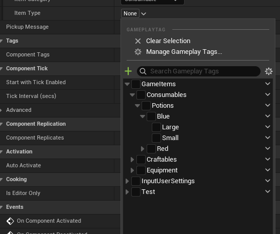

Unreal Engine C++ has its own set of abstractions, so you have to learn a lot of new patterns and systems in addition to vanilla C++. I put in commonly used Unreal C++ phrases that are used in common game development so that I can index them whenever I encounter them again.

# 1. Setting Timer

ex) you want a timer for your text block, so that it hides after a given time.

in this case, we use `GetWorld->GetTimerManager().SetTimer(time, delegate function)`

```cpp
GetWorld()->GetTimerManager().SetTimer(MessageTimer, [this]()
{
	MessageHide();
	bIsMessageActive = false;
}, MessageLifetime, false);
```

# 2. FastArray

For arrays that need to be broadcasted to multiple players efficiently, we use `FastArraySerializer`

1. Setting Entry and Array as friend class is common practice
2. `TStructOpsTypeTraits - WithNetDeltaSerializer = True must be set to add this type to delta serializer in your reflection system.`
3. MarkItemDirty on add, MarkArrayDirty on remove.

- FastArray.h

```cpp
USTRUCT(BlueprintType)
struct FInv_InventoryEntry: public FFastArraySerializerItem
{
	GENERATED_BODY()

	FInv_InventoryEntry() {}

private:
	friend UInv_InventoryComponent;
	friend FInv_InventoryFastArray;

	UPROPERTY()
	TObjectPtr<UInv_InventoryItem> Item = nullptr;
};

/**
 * List of Inventory Items
 */
USTRUCT(BlueprintType)
struct FInv_InventoryFastArray: public FFastArraySerializer
{
	GENERATED_BODY()

	FInv_InventoryFastArray(): OwnerComponent(nullptr) {}
	FInv_InventoryFastArray(UActorComponent* InOwnerComponent): OwnerComponent(InOwnerComponent) {}

	TArray<UInv_InventoryItem*> GetAllItems() const;

	// FFastArraySerializer contract
	void PreReplicatedRemove(const TArrayView<int32> RemovedIndices, int32 FinalSize);
	void PostReplicatedAdd(const TArrayView<int32> AddedIndices, int32 FinalSize);
	// End of FFastArraySerializer contract

	bool NetDeltaSerialize(FNetDeltaSerializeInfo& DeltaParams)
	{
		return FastArrayDeltaSerialize<FInv_InventoryEntry, FInv_InventoryFastArray>(Entries, DeltaParams, *this);
	}

	UInv_InventoryItem* AddEntry(UInv_ItemComponent* ItemComponent);
    UInv_InventoryItem* AddEntry(UInv_InventoryItem* Item);
	void RemoveEntry(UInv_InventoryItem* Item);

private:
	friend UInv_InventoryComponent;

	UPROPERTY()
	TArray<FInv_InventoryEntry> Entries;

	UPROPERTY(NotReplicated)
	TObjectPtr<UActorComponent> OwnerComponent;
};

template<>
struct TStructOpsTypeTraits<FInv_InventoryFastArray> : TStructOpsTypeTraitsBase2<FInv_InventoryFastArray>
{
	// Sets flag that makes reflection system know that this particular type should be delta serialized.
	enum { WithNetDeltaSerializer = true };
};
```

- FastArray.cpp

```cpp
UInv_InventoryItem* FInv_InventoryFastArray::AddEntry(UInv_InventoryItem* Item)
{
	check(OwnerComponent);
	AActor* OwningActor = OwnerComponent->GetOwner();
	// why check? - only should do on server - in client crashes
	check(OwningActor->HasAuthority());

	FInv_InventoryEntry& NewEntry = Entries.AddDefaulted_GetRef();
	NewEntry.Item = Item;

	MarkItemDirty(NewEntry);
	return Item;
}

void FInv_InventoryFastArray::RemoveEntry(UInv_InventoryItem* Item)
{
	for (auto EntryIt = Entries.CreateIterator(); EntryIt; ++EntryIt)
	{
		if (EntryIt->Item == Item)
		{
			EntryIt.RemoveCurrent();
			MarkArrayDirty();
		}
	}
}
```

# 3. FindComponentByClass

Very useful, but also costly -> if the class must have the component, **declare as a member function instead of doing this dynamic search.**

```cpp
UInv_InventoryComponent* UInv_InventoryStatics::GetInventoryComponent(const APlayerController* PlayerController)
{
	if (IsValid(PlayerController))
	{
		return nullptr;
	}

	UInv_InventoryComponent* InventoryComponent = PlayerController->FindComponentByClass<UInv_InventoryComponent>();
	return InventoryComponent;
}
```

# 4. Multicast Delegates

To create callback functions for Multicast, we

1. use `DECLARE_DYNAMIC_MULTICAST_DELEGATE_{params if there is}(delegate_type_name, param types, param names)`
2. Add the `delegate_type_names` members to the class
3. call `AddDynamic` on the member and bind the wanted callback.
4. call `.Broadcast` function on the member.

```cpp
// Header File

// 1. Declare Multicast Delegates
DECLARE_DYNAMIC_MULTICAST_DELEGATE_OneParam(FInventoryItemChange, UInv_InventoryItem*, Item);
DECLARE_DYNAMIC_MULTICAST_DELEGATE(FNoRoomInInventory);

UCLASS(ClassGroup=(Custom), meta=(BlueprintSpawnableComponent), Blueprintable)
class INVENTORY_API UInv_InventoryComponent : public UActorComponent
{
	GENERATED_BODY()

public:
	UInv_InventoryComponent();
	void ToggleInventoryMenu();

	// 2. Add Delegate members
	FInventoryItemChange OnItemAdded;
	FInventoryItemChange OnItemRemoved;
	FNoRoomInInventory NoRoomInInventory;


// .cpp file
// 3. AddDynamic to bind wanted callback
if (IsValid(InventoryComponent))
{
	InventoryComponent->NoRoomInInventory.AddDynamic(this, &ThisClass::OnNoRoom);
}

// 4. Broadcast
void UInv_InventoryComponent::TryAddItem(UInv_ItemComponent* ItemComponent)
{
	NoRoomInInventory.Broadcast();
}
```

# 5. InstancedStruct

1. Instanced along with its owner
2. Can be used polymorphically - have childs derived while being exposed to Blueprint

```cpp
// Header
#pragma once

#include "CoreMinimal.h"
#include "StructUtils/InstancedStruct.h"
#include "UObject/Object.h"
#include "Inv_InventoryItem.generated.h"

UCLASS()
class INVENTORY_API UInv_InventoryItem : public UObject
{
	GENERATED_BODY()
public:
    // Need to override this to set lifetime
	virtual void GetLifetimeReplicatedProps(TArray<class FLifetimeProperty>& OutLifetimeProps) const override;

private:

	// Can only be FInv_ItemManifest and childs of that class
	UPROPERTY(VisibleAnywhere, meta=(BaseStruct="/Script/Inventory.Inv_ItemManifest"), Replicated)
	FInstancedStruct ItemManifest;
};

// cpp file


#include "Net/UnrealNetwork.h"
#include "Items/Inv_InventoryItem.h"

void UInv_InventoryItem::GetLifetimeReplicatedProps(TArray<class FLifetimeProperty>& OutLifetimeProps) const
{
	UObject::GetLifetimeReplicatedProps(OutLifetimeProps);

	DOREPLIFETIME(ThisClass, ItemManifest);
}
```

# 6. Gameplay Tags

How can I give unique types for every game item?

- If we do it with Enum we have to add every time new item is made
- We use **Gameplay Tags**

1. NativeGameplayTags.h
2. Add "GameplayTags" in build.cs
3. Define namespace and add types to namespaces using `UE_DECLARE_GAMEPLAY_TAG_EXTERN`

```cpp
# Tags.h
namespace GameItems
{
	namespace Equipment
	{
		namespace Weapons
		{
			UE_DECLARE_GAMEPLAY_TAG_EXTERN(Axe)
			UE_DECLARE_GAMEPLAY_TAG_EXTERN(Sword)
		}

		namespace Cloaks
		{
			UE_DECLARE_GAMEPLAY_TAG_EXTERN(RedCloak)
		}

		namespace Masks
		{
			UE_DECLARE_GAMEPLAY_TAG_EXTERN(SteelMask)
		}
	}
	namespace Consumables
	{
		namespace Potions
		{
			namespace Red
    		{
    			UE_DECLARE_GAMEPLAY_TAG_EXTERN(Small)
    			UE_DECLARE_GAMEPLAY_TAG_EXTERN(Large)
    		}

    		namespace Blue
    		{
    			UE_DECLARE_GAMEPLAY_TAG_EXTERN(Small)
    			UE_DECLARE_GAMEPLAY_TAG_EXTERN(Large)
    		}
		}
	}

	namespace Craftables
	{
		UE_DECLARE_GAMEPLAY_TAG_EXTERN(FireFernFruit)
		UE_DECLARE_GAMEPLAY_TAG_EXTERN(LuminDaisy)
		UE_DECLARE_GAMEPLAY_TAG_EXTERN(ScorchPetalBlossom)
	}
}
```

4. In source file, define in the same namespace using `UE_DEFINE_GAMEPLAY_TAG`

```cpp
#include "Items/Inv_ItemTags.h"


namespace GameItems
{
	namespace Equipment
	{
		namespace Weapons
		{
			UE_DEFINE_GAMEPLAY_TAG(Axe, "GameItems.Equipment.Weapons.Axe")
			UE_DEFINE_GAMEPLAY_TAG(Sword, "GameItems.Equipment.Weapons.Sword")
		}

		namespace Cloaks
		{
			UE_DEFINE_GAMEPLAY_TAG(RedCloak, "GameItems.Equipment.Cloaks.RedCloak")
		}

		namespace Masks
		{
			UE_DEFINE_GAMEPLAY_TAG(SteelMask, "GameItems.Equipment.Masks.SteelMask")
		}
	}
	namespace Consumables
	{
		namespace Potions
		{
			namespace Red
			{
				UE_DEFINE_GAMEPLAY_TAG(Small, "GameItems.Consumables.Potions.Red.Small")
				UE_DEFINE_GAMEPLAY_TAG(Large, "GameItems.Consumables.Potions.Red.Large")
			}

			namespace Blue
			{
				UE_DEFINE_GAMEPLAY_TAG(Small, "GameItems.Consumables.Potions.Blue.Small")
				UE_DEFINE_GAMEPLAY_TAG(Large, "GameItems.Consumables.Potions.Blue.Large")
			}
		}
	}

	namespace Craftables
	{
		UE_DEFINE_GAMEPLAY_TAG(FireFernFruit, "GameItems.Craftables.FireFernFruit")
		UE_DEFINE_GAMEPLAY_TAG(LuminDaisy, "GameItems.Craftables.LuminDaisy")
		UE_DEFINE_GAMEPLAY_TAG(ScorchPetalBlossom, "GameItems.Craftables.ScorchPetalBlossom")
	}
}
```



# 7. Move Semantics in Unreal - "MoveTemp"

```cpp
FInv_SlotAvailabilityResult UInv_InventoryGrid::HasRoomForItem(const FInv_ItemManifest& Manifest)
{
	FInv_SlotAvailabilityResult Result;
 	Result.TotalRoomToFill = 1;

	FInv_SlotAvailability SlotAvailability;
	SlotAvailability.AmountToFill = 1;
	SlotAvailability.Index = 0;
	SlotAvailability.bItemAtIndex =false;

	Result.SlotAvailabilities.Add(MoveTemp(SlotAvailability));
 	return Result;
}
```

# 8. requires to Give Trait Bounds

```cpp
template<typename T>
requires std::derived_from<T, FInv_ItemFragment>
const T* FInv_ItemManifest::GetFragmentByTag(const FGameplayTag& Tag) const;
```
