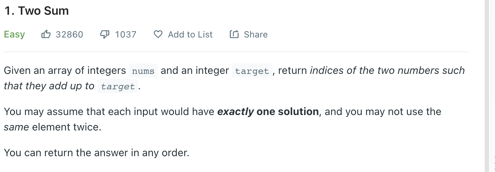
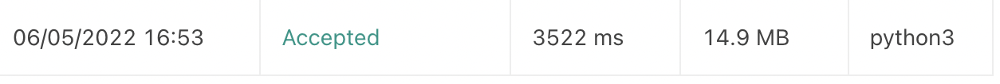
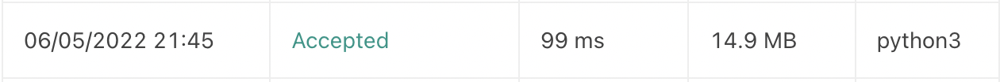
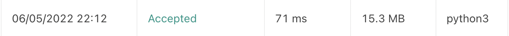

# 1. Two Sums
LeetCode 가장 위에 있는 문제.

문제: https://leetcode.com/problems/two-sum/



### Solution1 : Memory O(1), Time O(n^2)

```python
# O(n^2) Solution

empty_index = -1 

class Solution:
    def find(self, nums, target, i):
        for j in range(i + 1, len(nums)):
            if nums[j] == target:
                return j
        
        return empty_index
    
    def twoSum(self, nums: List[int], target: int) -> List[int]:
        for (i, num) in enumerate(nums):
            remainder = target - num
            
            find_result = self.find(nums, remainder, i)
            
            if find_result >= 0:
                return [i, find_result]
        return [empty_index, empty_index]
```





### Solution2 : Memory O(n), Time O(n * log(n))

sort와 binary search를 사용하면 n*log(n) 시간안에 계산이 가능하다.

```python
# O(nlog(n)) Solution - binary search + sort

from bisect import bisect, bisect_left

class Solution:
    def binary_search(self, nums, target):
        result = bisect_left(nums, target)

        if result != len(nums) and target == nums[result]:
            return result, True
        
        return -1, False

    def search_indexes(self, nums, answer_values):
        indexes = []

        for answer in answer_values:
            for (i, num) in enumerate(nums):
                if num == answer and i not in indexes:
                    indexes.append(i)
                    break

        return indexes


    def twoSum(self, nums: List[int], target: int) -> List[int]:
        sorted_nums = nums.copy()
        sorted_nums.sort()

        for num in sorted_nums:
            pair_search, success = self.binary_search(sorted_nums, target - num)

            if success:
                answer_values = [num, sorted_nums[pair_search]]
                return self.search_indexes(nums, answer_values)
        
        return [-1, -1]
```




여기서 끝나면 괜찮은 문제겠지만, 여기서 한 번 더 발전 가능해서 추천이 많은 좋은 문제인 것으로 보인다.

### Solution3 : Memory O(n), Time O(n)
왠만한 문제의 치트키는 역시 HashMap인 것 같다. Python의 Hashmap과도 같은 Dictionary를 사용하여 구현.

# O(n) Solution - HashMap 

key 로 num, value 로 index를 갖는 dict를 만들어서 nums를 iterate하면서 target - num이 dictionary에 없으면 hashmap에 num을 넣고, 아니면
i 와 dict[target - num] 을 넣는다.

```python
# O(n) solution using HashMap(dict)

class Solution:
    def twoSum(self, nums: List[int], target: int) -> List[int]:
        dict_nums = {} 

        for i, num in enumerate(nums): 
            remainder = target - num
            if remainder in dict_nums: 
                return [i, dict_nums[remainder]]
            
            dict_nums[num] = i

        return [-1, -1]
```

