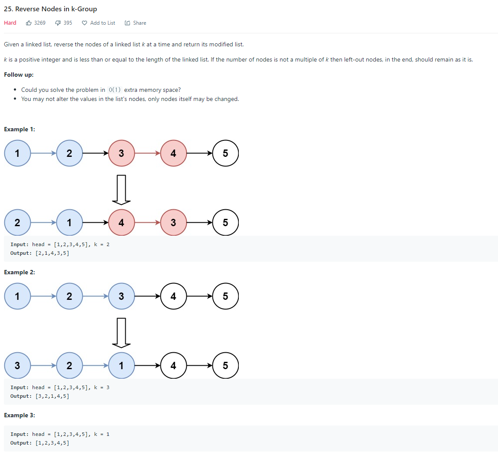
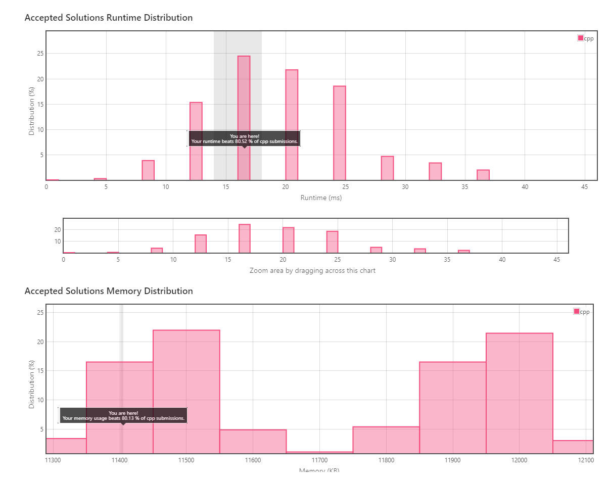
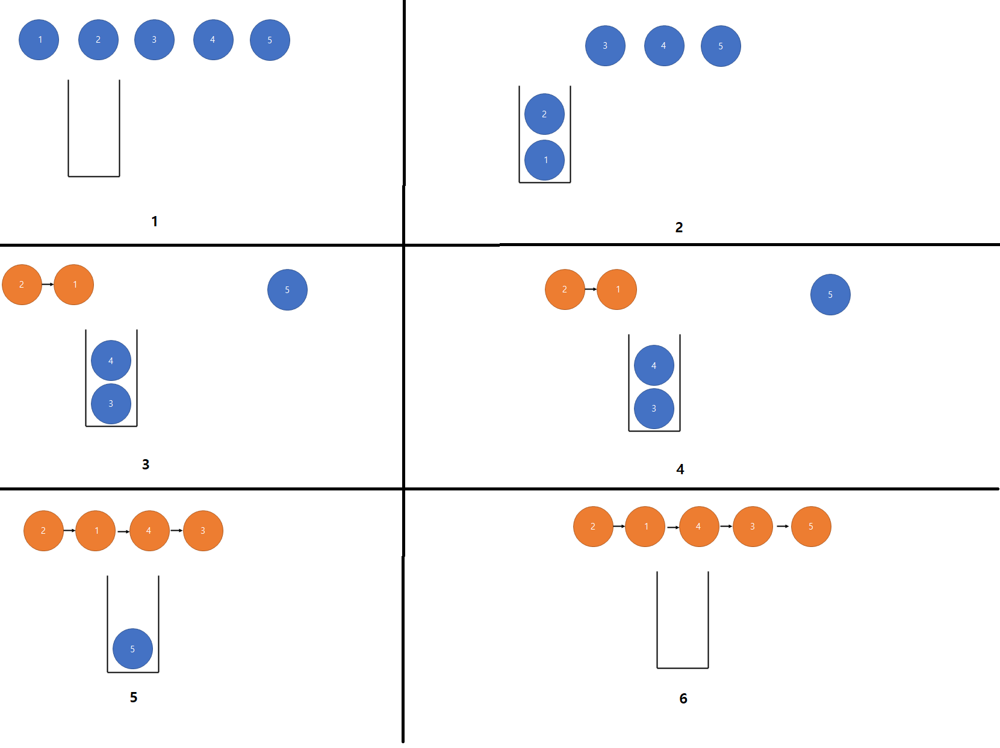
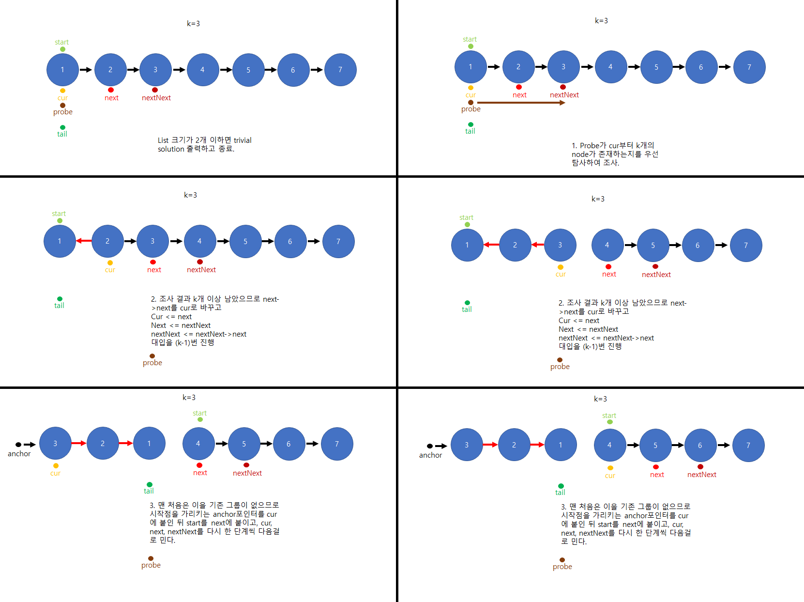
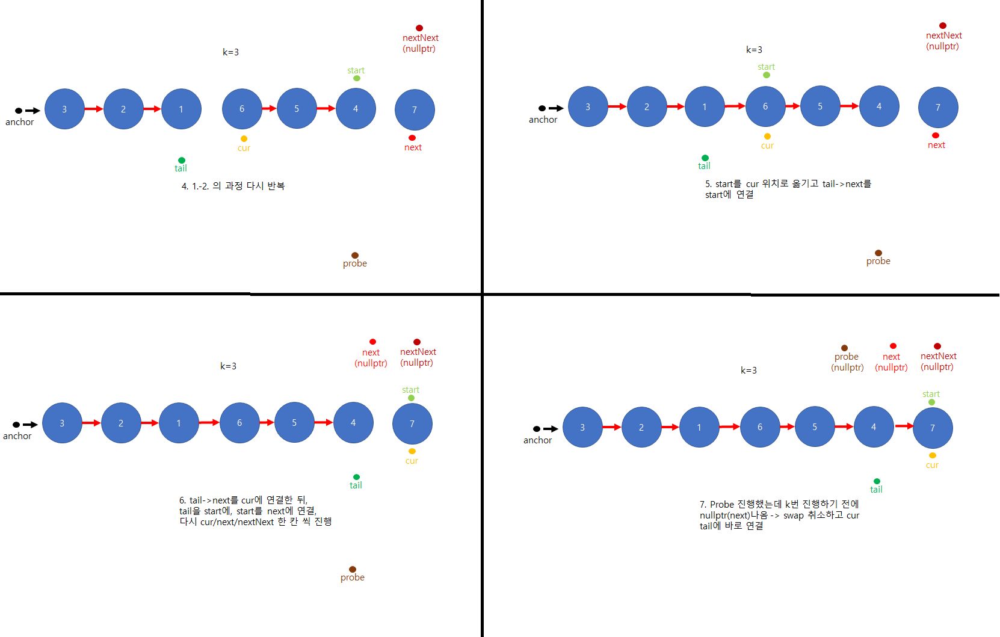
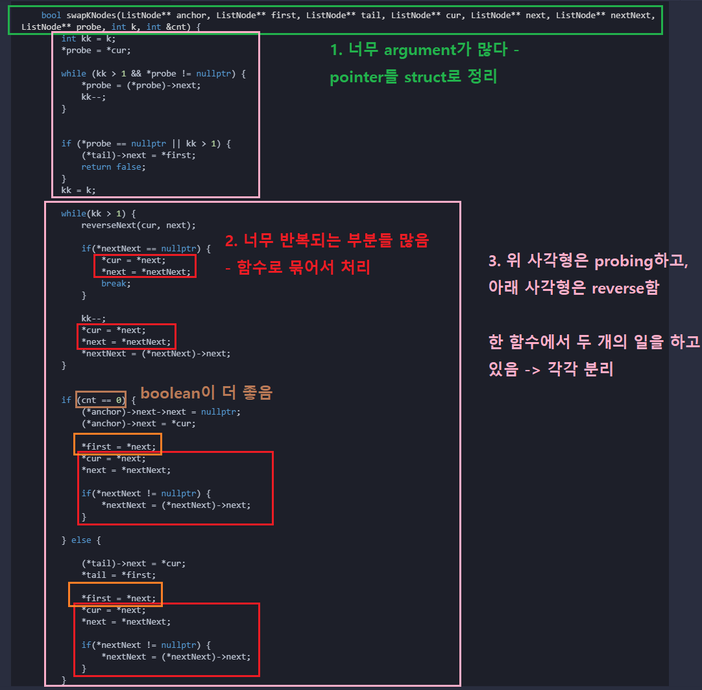

# #25: Reverse Nodes In k-Group

* 문제 URL: https://leetcode.com/problems/reverse-nodes-in-k-group/



## 문제 Comment
* Memory, Runtime을 고려하지 않고 작성한다면 그렇게 어렵게 생각할 필요 없는 문제다
* Memory가 O(n)이어도 된다면 k size stack을 사용해 넣고 빼면서 하나씩 이으면 된다.
* 하지만 **Main Challenge는 O(1) extra space를 이용해서 해결하는 것.**
    * 이 조건을 만족하려면 끔찍하게 복잡하고 Corner case가 많은 Pointer연산을 진행해야 한다.

## 해결 요약
* 해결 언어: C++
* Performance: **속도 상위 20%, 메모리 상위 20%**




* Stack 을 사용한 O(n) 메모리 해결 방법:
  </br></br>

   * 간단하지만 Worst case인 k = stack_size의 경우 O(n) memory space를 소모한다.

* 포인터 여섯 개(start/end, cur/next/nextNext, probe, anchor)를 이용한 O(1) 메모리 해결 방법
     * start: 현재 group 시작 위치 - iteration후 현재 group의 tail이 된다.
     * tail: 이전 group의 tail
     * cur: 현재 node - iteration 끝나면 현재 group의 head가 된다.
     * next: 현재 node 다음 node - iteration 끝나면 다음 group의 start가 된다.
     * nextNext: 현재 node 다음다음 node
     * probe: null pointer exception을 방지하기 위해 현재 group에 k개가 있는지 미리 탐방.
     * anchor: 맨 처음 group의 start랑 연결시켜줌. 시작점 저장용.






* 최초 해결 코드: 끔찍하다..

```cpp
class Solution {
public:
    ListNode* reverseKGroup(ListNode* head, int k) {
        if (head->next == nullptr) {
            return head;
        } else if (head->next->next == nullptr) {
            if(k == 1) {
                return head;
            } else {
                ListNode* next = head->next;
                next->next = head;
                head->next = nullptr;
                return next;
            }
        }
        
        ListNode* anchor = new ListNode(0, head);
        ListNode* start = head;
        ListNode* first = head;
        ListNode* tail = head;
        ListNode* cur = head;
        ListNode* next = head->next;
        ListNode* nextNext = head->next->next;
        ListNode* probe = cur;

        int cnt = 0;

        while(swapKNodes(&anchor, &first, &tail, &cur, &next, &nextNext, &probe, k, cnt)) {

        }

        return anchor->next;
    }
    
    void reverseNext(ListNode** cur, ListNode** next) {
        (*next)->next = *cur;
    }
    
    bool swapKNodes(ListNode** anchor, ListNode** first, ListNode** tail, ListNode** cur, ListNode** next, ListNode** nextNext, ListNode** probe, int k, int &cnt) {
        int kk = k;
        *probe = *cur;

        while (kk > 1 && *probe != nullptr) {
            *probe = (*probe)->next;             
            kk--;
        }
        

        if (*probe == nullptr || kk > 1) {
            (*tail)->next = *first;       
            return false;
        }           
        kk = k;
        
        while(kk > 1) {
            reverseNext(cur, next);    
            
            if(*nextNext == nullptr) {
                *cur = *next;
                *next = *nextNext;
                break;
            }
    
            kk--;
            *cur = *next;
            *next = *nextNext;
            *nextNext = (*nextNext)->next;
        }

        
        if (cnt == 0) {
            (*anchor)->next->next = nullptr;
            (*anchor)->next = *cur;
            
            *first = *next; 
            *cur = *next;
            *next = *nextNext; 

            if(*nextNext != nullptr) {  
                *nextNext = (*nextNext)->next;
            } 
            
        } else {
 
            (*tail)->next = *cur;            
            *tail = *first;
            
            *first = *next; 
            *cur = *next;
            *next = *nextNext; 

            if(*nextNext != nullptr) {  
                *nextNext = (*nextNext)->next;
            } 
        }
        
        
        cnt++;
        return true;
    }
};

```

* 리팩토링 해야하는 부분
    * 반복되는 부분이 너무 많다.
    * 함수 인자로 너무 많은 함수들이 들어간다
    * nested if-else는 함수로 끊어준다.



* 이러한 변경점들로 리팩토링을 해주면 다음처럼 변한다.

```cpp
class Solution {
public:  
    bool shorterThanTwo(ListNode* head) {
        return (head->next == nullptr) || (head->next->next == nullptr);
    }

    ListNode* trivialAnswer(ListNode* head, const int k) {
        if (head->next == nullptr || k == 1) {
            return head;
        } 
        
        ListNode* next = head->next;
            next->next = head;
            head->next = nullptr;
        return next;
    }

    bool hasNext(ListNode** const probe, const int index) {
        return (index > 1) && (*probe != nullptr);
    }

    bool hasKNodes(PointerList& pointers, const int k) {
        int index = k;
        auto& probe = pointers.probe;
        auto& cur = pointers.cur;
        
        *probe = *cur;
        
        while (hasNext(probe, index)) {
            *probe = (*probe)->next;
            index--;
        }

        return (*probe != nullptr) && (index == 1);
    }

    void proceedOneStep(
        PointerList& pointers
    ) {
        auto& cur = pointers.cur;
        auto& next = pointers.next;
        auto& nextNext = pointers.nextNext;
        
        *cur = *next;
        *next = *nextNext;

        if (*nextNext != nullptr) {
            *nextNext = (*nextNext)->next;         
        }
    }

    void proceedUntilCurAtGroupLastNode(PointerList& pointers, const int& k) {
        int index = k;
        auto& cur = pointers.cur;
        auto& next = pointers.next;
        auto& nextNext = pointers.nextNext;
        auto& anchor = pointers.anchor;
        while (index > 1) {
            (*next)->next = *cur;
            proceedOneStep(pointers);

            index--;
        }
    }

    void anchorStartingPoint(ListNode** anchor,ListNode** cur) {
        (*anchor)->next->next = nullptr;
        (*anchor)->next = *cur;
    }

    void updateGroupEndPointers(PointerList& pointers, bool& isFirstGroup) {
        auto& anchor = pointers.anchor;
        auto& cur = pointers.cur;
        auto& next = pointers.next;
        auto& start = pointers.start;
        auto& tail = pointers.tail;

        if (isFirstGroup) {
            anchorStartingPoint(anchor, cur);
            isFirstGroup = false;
        } else {
            (*tail)->next = *cur;            
            *tail = *start;
        }
        
        *start = *next;
    }
    
    void swapKNodes(PointerList& pointers, bool &isFirstGroup, const int &k) {
        proceedUntilCurAtGroupLastNode(pointers, k);
        updateGroupEndPointers(pointers, isFirstGroup);
        proceedOneStep(pointers);
    }

    ListNode* reverseKGroup(ListNode* head, int k) {
        if (shorterThanTwo(head)) {
            return trivialAnswer(head, k);
        }
        
        PointerList pointers = PointerList(&head);
        bool isFirstGroup = true;

        while (hasKNodes(pointers, k)) {
            swapKNodes(pointers, isFirstGroup, k);
        }

        auto& tail = pointers.tail;
        auto& start = pointers.start;
        auto& anchor = pointers.anchor;
        
        (*tail)->next = *start;  

        return (*anchor)->next;
    }
};
```

* 오히려 코드 길이가 길어졌다. 이는 pointer 값들이 너무 많고, pointer의 pointer들이라 declare안하고 쓰기엔 *operator이랑 괄호가 너무 덕지덕지 붙어 번거로워 지기 때문이다.
* 이걸 pointer로 다시 풀기엔 pointer가 너무 많아 보기 좋지 않다.
* https://www.youtube.com/watch?v=1UOPsfP85V4 에 tail/probe pointer 없이 해결하는 방법이 있다. Probing하면서 다음 group의 첫 node를 start에 저장하고 맨 첫 cur->next를 start로 지장하는 방법이다.