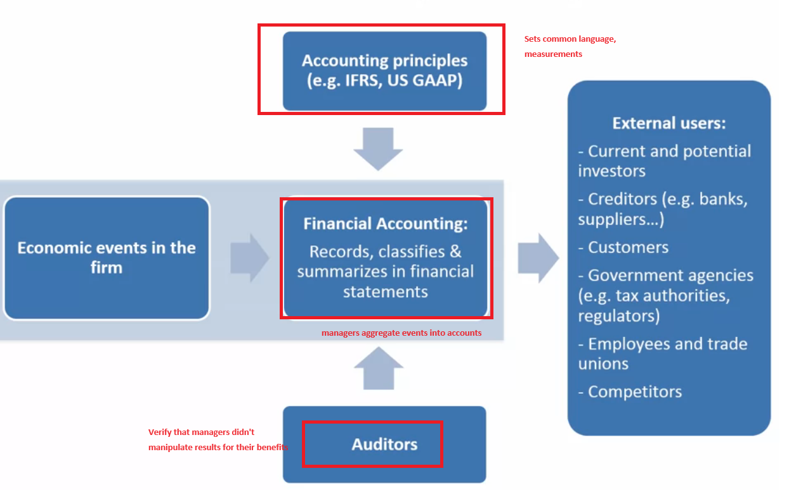
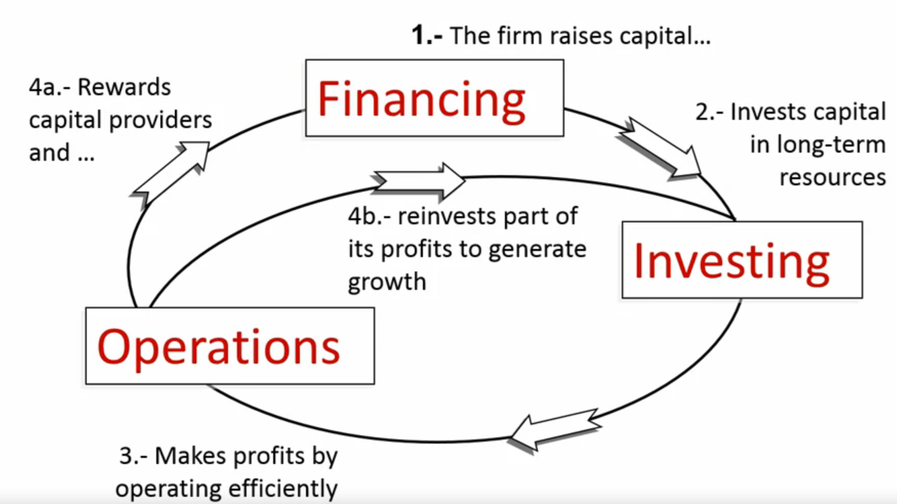
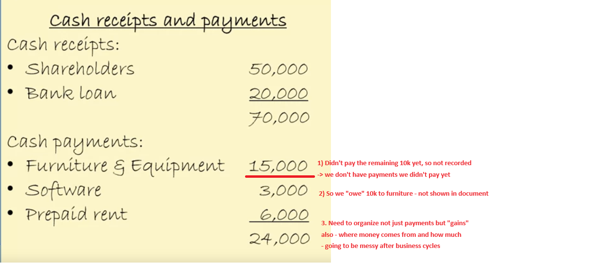
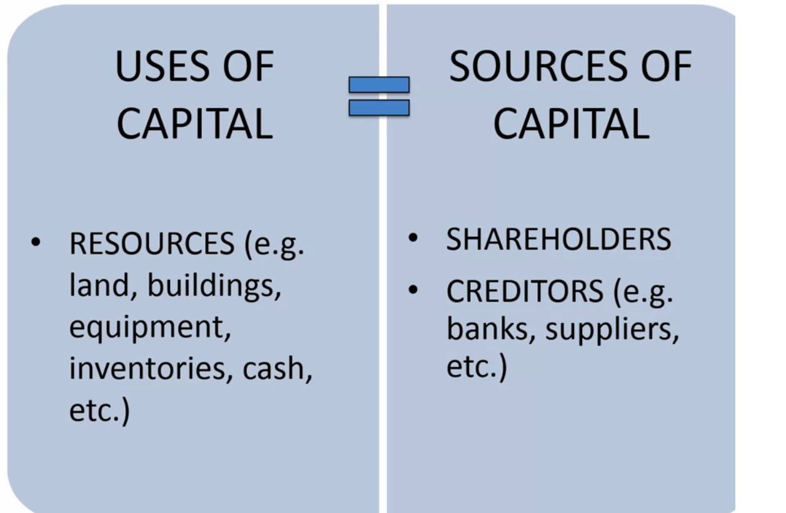
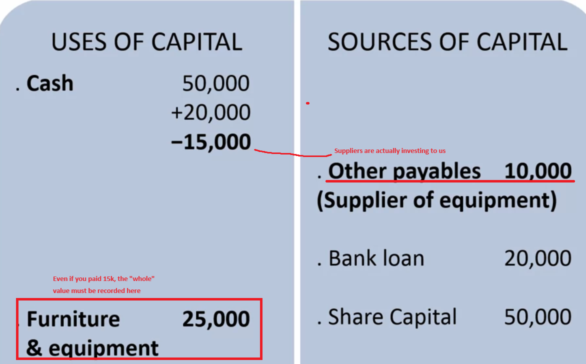

# Financial Accounting

## Business Cycle

## Types of Accounting
* Cash accounting: keeping records of payments and purchases ex) receipts 
* Problem: No record about the capital outside of cash(loan, invest, etc)

* We need to keep track of uses of capital and the source those capital came from

* **Double entry of accounting: Sum(Uses of capital) = Sum(Source of capital) - very good for double checking**

* a loan is an investment!

