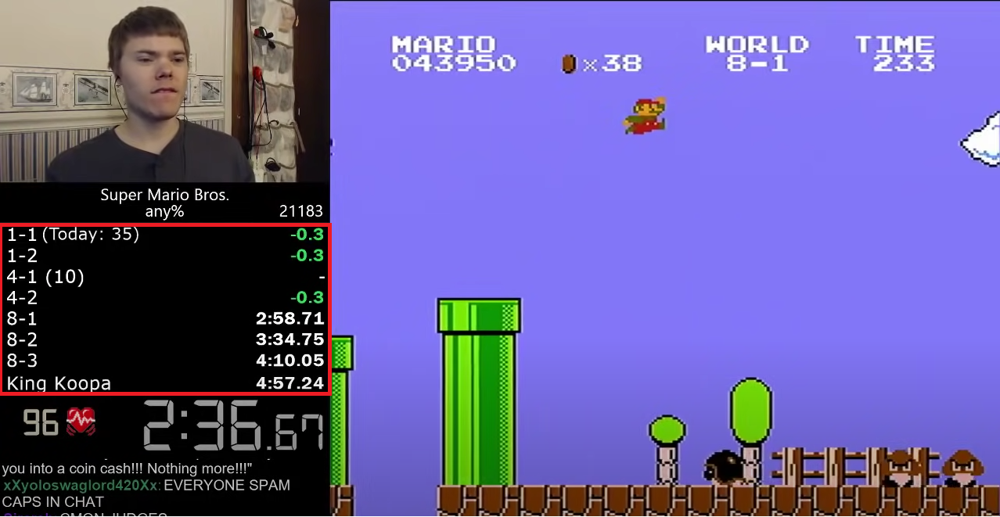
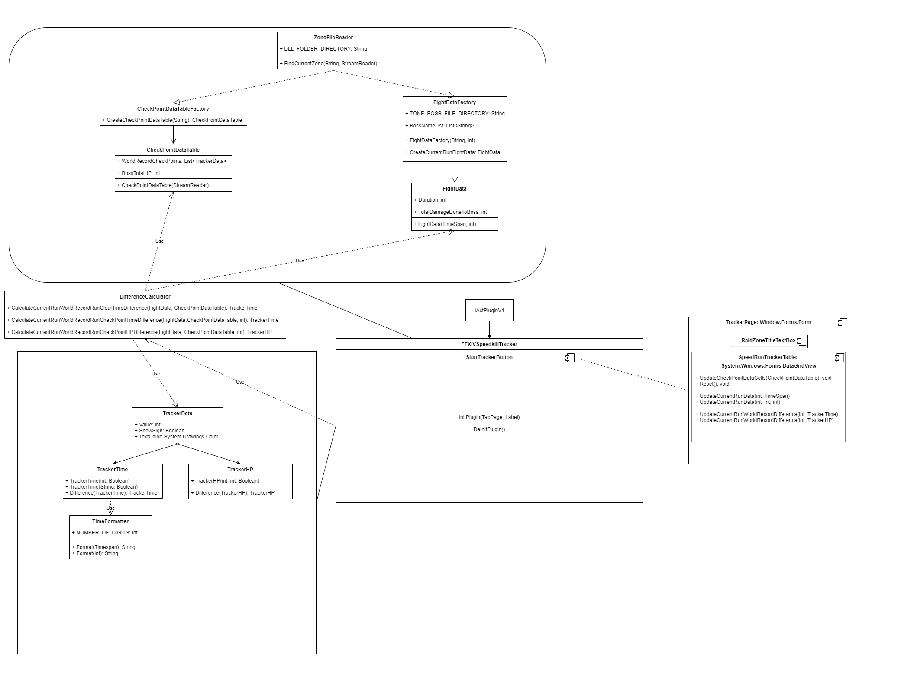
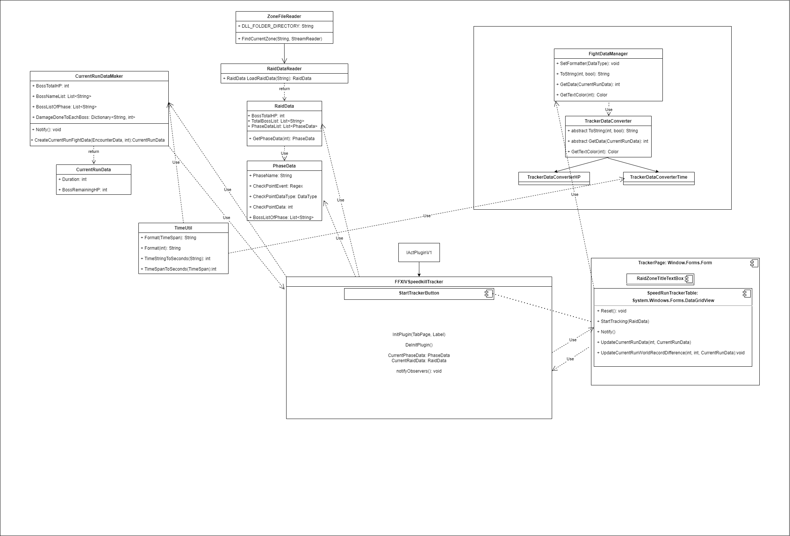

# 리팩토링 / 디자인 패턴 예시 1 - FFXIV Speedkill Tracker
얼마 전 Head First Design Pattern을 읽으면서 여러 디자인 패턴들에 대해 배웠다.
이를 활용하여 소프트웨어 디자인에 대한 연습을 하기 위해 저번에 side project로 진행했던 FFXIV Speedkill Tracker의 구조를 개선해보기로 한다.

## FFXIV Speedkill Tracker
* 파이널판타지 14는 최고급 난이도 레이드들에 대해 8인 팀이 얼마나 빠르게 보스를 잡는지를 대결하는 스피드런 문화가 있다.
  

* 이 때 개개인의 실력도 중요하지만, 다른 게임들의 스피드런들처럼 RNG(Random Number Generator, 운) 로 인한 변수가 굉장히 크기 때문에 치명타가 뜨냐 안뜨냐 등등으로 같은 스킬들을 써도 데미지 편차가 많이 나고,
이 때문에 너무 운이 안좋아서 가망이 없는 트라이들은 빨리 리셋해야만 시간을 절약할 수 있다.

* 하지만 이 때 정확한 측정 기계가 없어서 경험적인 부분에 의존해야 하고(ex) 1분 지났을 때 보스 HP가 90%), 이거는 팀만 알고 있기 때문에 시청자들이 볼 때는 현재 트라이가 괜찮은 것인지를 알 방법이 없다.
* 이를 해결하기 위해 다른 게임의 스피드런들은 checkpoint를 설정해주고 각 checkpoint에 대해 현재 World Record/Personal Best와 얼마 차이가 나는지를 알려주는 플러그인이 있다.

* 이러한 플러그인을 파이널판타지 14 에서도 사용할 수 있도록 구현한 플러그인이 바로 FFXIV Speedkill Tracker이다.

## 현재의 클래스 다이어그램 및 요소 설명
혼자 쓸 예정이었던 사이드 프로젝트고, 바뀔 일도 거의 없어서 클래스 다이어그램이 엉망이다....

클래스들의 역할을 설명하자면
  
### 1) FFXIVSpeedkillTracker
플러그인의 Main Class로, 게임에서 발생한 모든 이벤트 및 데이터를 저장하는 메인 애플리케이션 Advanced Combat Tracker에서

### 2) ZoneFileReader: 
보스 데이터는 FFXIV Speedkill Tracker에서 가장 변동성이 큰 부분이다.

패치 때마다 엔드 게임 보스가 바뀌어서 매번 보스의 정보 및 페이즈들이
바뀌어야 하고, 또한 월드 1등의 기록이 바뀔 때마다 페이즈 별 커트라인이 바뀌어야 한다. 

이러한 변동성에 대처하기 위해 **보스에 대한 정보는 모두 Text File에서 config 처럼 runtime에 읽도록 하였다.**

이 때 File을 읽을 때 필요한 간단한 Util (ex) 파일 현재 주소, 파일에서 현재 레이드에 대한 데이터 시작 위치 찾기) 들을 이 ZoneFileReader라는 class에 추가하였고, 이를 상속함으로써 zone에 대해 필요한 정보를 얻을 수 있다.

### 3) FightDataFactory
ZoneFileReader를 상속하는 첫 번째 클래스로, 레이드 존에 대한 
각 페이즈별 메인 보스들(페이즈에 따라 보스가 바뀔 때가 있다)과 
메인 보스들의 개수(보스가 여러명일 때도 있다)를 읽어서
FightData를 만들 때 어떤 보스들에게 들어간 피해를 보면 되는지를 알려준다.

이를 통해 FightDataFactory는
1) Advanced Combat Tracker에서 현재까지의 싸움에 대한 모든 데이터를 저장한 instance인 EncounterData를 받고,

2) EncounterData에서 **현재 페이즈의 메인 보스들에게 들어간 데미지 + 현재 Fight의 소요 시간을 파싱하여 그 정보를 FightData로 만들어준다.**

### 4) FightData
파이널 판타지의 스피드런 체크에 필요한 데이터들을 보관한 데이터 구조다.
파이널 판타지 14의 스피드런 체크는 레이드의 특성에 따라 두 가지로 나뉜다:

1) 단일 보스를 빨리 잡아야 할 때: 이 때는 보스의 HP가 진행도이므로 메인 보스의 HP가 주 Metric이 된다.
2) 페이즈마다 보스가 다를 때: 이 때는 페이즈마다 하나의 독립적인 레이드가 있다고 생각을 해야 하므로 **보스의 HP보단 각 페이즈마다 보스를 잡은 시각이 언제인지를 비교해야 각 페이즈에서 다른 팀들보다 얼마나 앞서있는가를 알 수 있다.**

즉, FightData는 **Boss에게 입힌 데미지 총량과 현재 트라이의 진행 시간 두 개를 다 기록하여 1) 2) 를 언제든 제공할 수 있게 한다.**

### 5) CheckPointDataTable
현재 레이드의 스피드런 트래킹을 위해 필요한 모든 정보를 저장한다.

1) 현재 보스의 총 체력
2) 세계 기록의 클리어 타임
3) 체크포인트가 되는 각 페이즈에 대한 정보를 저장한 Array 및 그 체크포인트의 타입(HP 기록인가 페이즈 클리어 시간 기록인가)

### 6) TrackerData
저장해야 되는 데이터에 대한 캡슐화 데이터
HP, 시간 데이터 중 하나를 저장하는데, 이 때 데이터만 저장하면 되는 게 아니라 여러 가지 연산과 Util, 전처리 작업을 해야 한다:

* HP 데이터면 raw data인 입힌 피해보다는 그걸 보스 전체 체력에서 빼서 남은 체력으로 변환해주는게 유저 입장에서 좋음
* 시간 데이터면 mm:ss 형식으로 나타내주는 것이 좋음
* HP 시간 데이터 모두 **World Record값과의 비교(뺄셈) 연산이 필요하고, 이 때 diff 를 효과적으로 print하기 위해 앞서있다면(즉, 값이 음수) 초록색, 같다면 까만색, 뒤쳐져있다면 (양수면) 빨간색으로 색깔을 조정해준다.**

현재 Run에 대한 데이터를 이러한 전처리 작업들로 감싼 클래스가 TrackerData클래스고, TrackerHP, TrackerTime은 각각 보스 체력, 클리어 타임 데이터를 저장한다.

### 7) SpeedRunTrackerTable
핵심 UI인 비교 테이블로, World Record와 현재 Run의 각 페이즈 진행 상황, 그리고 World Record와의 차이를 보여줌.

## 현재 디자인 리팩토링 해보기
최근 디자인 패턴/리팩토링/아키텍처 관련 도서를 많이 배우면서 6달 전 내가 회사를 들어오기 전 첫 사이드 프로젝트였던 FFXIV Speedkill Tracker의 구조에 직접 배운 것들을 적용해보는게 효과적일 거라 생각했다.

회사에 와서 성장을 한 건지 책이 도움이 많이 됐던 건지는 모르겠지만.... 6달 전 내가 짠 시스템은 정말 엉망이다 ㅋㅋ..
구조 자체가 이해하기 힘들고 합칠 수 있는 클래스들이 다 나뉘어져 있어 처리가 굉장히 복잡해진다.

### 1) 너무 남용된 Factory Class
저 당시에는 디자인 패턴에 대해 이해를 못했어서 구체 Instance를 생성하는 객체는 모두 Factory 클래스인 것으로 이해를 했고, 그렇게 생성하기가 너무 복잡한 코드는 모두 생성자를
Factory로 옮겨서 생성하게 했다.

그런데 사실 디자인 패턴에서의 팩토리는 **구체 형태가 여러 가지인 Subclass들을 만들 때 그 생성 과정을 캡슐화 하기 위해 사용하는 클래스다.**

현재 FFXIV Speedkill Tracker에서 FightData 인스턴스 타입은 단 한 개고, 트래킹 할 때 필요한 건 HP와 전투시간이 전부이므로 더 새로운 클래스가 등장할 위험도 없다.
마찬가지로 CheckPointDataTable도 두 개의 data만 받을 것이고, 다른 타입의 CheckPointDataTable이 생길 가능성은 거의 없다.
따라서 두 클래스의 Factory 클래스는 너무 과한 포장이고, 사실 이는 Factory의 역할을 하지도 않는다.

다만 이 Factory가 하는 역할인 **텍스트 파일을 읽어 인스턴스를 생성하는데 필요한 데이터를 수집** 이라는 기능은 캡슐화할 필요가 있고, 따라서 이 클래스 자체가 필요가 없는건 아니다.
하지만 Factory라는 클래스 이름은 디자인 관점에서 프로그래머에게 이 클래스에 대한 이해를 방해할 수 있으므로 **이름을 CheckPointDataReader, FightDataReader로 바꾸는 게 낫다.**
또한 CheckPointDataTable에는 텍스트 파일에서 필요한 데이터를 읽는 method들도 추가가 되어있는데, 이런 메소드들은 모두 DataReader로 옮기고 CheckPointDataTable은 페이즈들의 데이터만 관리하도록 모듈화 시킨다.

### 2) 유사한 기능을 수행하는 FightData, CheckPointDataTable
**FightData, CheckPointDataTable은 둘 다 현재 레이드에 관한 정보를 저장하는 데이터 구조라는 면에서 의미가 겹친다.**

그런데 현재 두 클래스가 따로따로 만들어져 있기에 서로 다른 텍스트 파일을 참조하고 있다.
FightData를 생성하기 위해 필요한 각 페이즈의 보스 수, 보스들의 이름은 BossData.txt를 사용하고
CheckPointDataTable를 생성하기 위해 필요한 데이터들은 ZoneData.txt를 사용한다.

그런데 **어차피 FightData에 필요한 각 페이즈의 보스 데이터는 페이즈 마다 있는 데이터니까 CheckPointDataTable에 같이 넣어도 된다.**
이렇게 되면 FightData에 필요한 페이즈 데이터는 텍스트 파일이 아니라 CheckPointDataTable에 있게 되고, 따라서 ZoneFileReader를 상속받아서
구현하는게 아니라 메인 클래스인 FFXIVSpeedKillTracker에서 CheckPointDataTable의 페이즈 데이터를 FightData를 만드는 객체에게 전송해주는 게 더 바람직하다.

### 3) TrackerTime, TrackerHP의 인터페이스 통합
TrackerTime, TrackerHP는 결국 하나의 Int 데이터를 가지고 있고 TrackerData를 상속하며,
World Record와의 차이를 계산하는 등의 API가 공유되어야 한다. 그런데 현재 모델은 그러한 API Polymorphism이 잘 구현이 안되고 있다.
Difference도 각각 인자로 받는 Type이 달라서 같이 사용할 수 없고, 따라서 Difference Calculator도 각 데이터 타입을 케이스별로 API를 가져야 한다.

이들을 통합하려고 하면 If(HP) {}, If(Time) 같은 이진 Branch문이 굉장히 많이 나오게 되서 개발 당시 어쩔 수 없이 했던 선택이다.
그런데 이런 경우에 최근에 배운 **State Pattern을 사용하면 해결된다는 것을 공부하였고, 이를 활용하여 TrackerHP, TrackerTime의 다형성을 활용할 계획이다.**

### 4) 모호한 클래스 이름들 수정
1) CheckPointDataTable: 여기서는 CheckPoint라는 이름을 썼는데, FFXIVSpeedkillTracker 같은 다른 클래스에서는 같은 개념을 phase로 명명하였다. 이에 따라 한 페이즈에 대한 데이터를 "PhaseData"로 수정하고, 구조체로 정의한다.
또한 한 레이드에 대한 PhaseData를 모두 모은 현재의 CheckPointDataTable을 RaidData라는 구조체로 바꾼다.
2) FightData: 현재 진행되고 있는 Run에 대한 데이터이므로 CurrentRunData로 바꾼다.

## 최종 결과
최종 리팩토링 결과는 아래와 같다:

FFXIV Speedkill Tracker의 가장 큰 문제는 두 가지였다:

1) Raid 에 대한 Data를 ZoneData, ZoneBoss 두 개의 text file에서 읽음 - 부적절한 data 분리
2) HP Tracking, Time Tracking 각각에 대해 API가 한 개씩 생김 (DifferenceCalculator, SpeedRunTrackerTable의 API들이 HP, Time에 대해 각각 있음)

1번은 해결하기 쉽다. ZoneData, ZoneBoss의 데이터를 한 개로 통합하여 한 개의 통합 클래스를 만들면 된다.
이 때 **파일에서 읽는 역할과 읽은 Data를 저장하는 역할을 다른 클래스로 분리하고 싶으므로 RaidDataReader과 RaidData로 분리한다.**

이렇게 Raid에 대한 전체 Data를 RaidData로 저장한 뒤, CurrentRunDataMaker(이전의 FightDataFactory)에게는 FFXIVSpeedkillTracker을 통해 필요한 Data인 현재 phase의
boss 리스트 정도만 전달하면 된다.

2번을 해결하기 위해서 **시간과 HP를 둘 다 같은 int data로 캡슐화 된 것으로 보고, 출력할 때만 시간, HP중 맞는 형식으로 Formatting해주는 클래스를 state pattern을 사용하여 지정해준다.**

즉 FightDataManager은 int 데이터를 mm:ss 형식으로 변환해주는 TrackerDataConverterTime 클래스와 보스의 남은 HP % 로 변환해주는 TrackerDataConverterHP클래스를 둘 다 갖고 있고,
**Phase가 바뀔 때마다 그 Phase에서 tracking해야 되는 DataType에 따라 SetFormatter을 통해 알맞은 Formatter로 바꿔준다.**

